# SakuraPlugins

作成したプラグインを公開します。

| pluginImage                                                                                                                                                                                                                                                            | バージョン | 前提プラグイン                                                              | 内容                                                                                                                                                                               |
| ---------------------------------------------------------------------------------------------------------------------------------------------------------------------------------------------------------------------------------------------------------------------- | ---------- | --------------------------------------------------------------------------- | ---------------------------------------------------------------------------------------------------------------------------------------------------------------------------------- |
|                                                                                                                                                            | 🎉1.0.3     | なし                                                                        | [Sakura_ ShowChapterTitle](Sakura_ShowChapterTitle/Sakura_ShowChapterTitle.md)   🌟章タイトルをサクッと出せる                                                                 |
|                                                                                                                                                  | 🎉1.0.1     | なし                                                                        | [Sakura_ FontSizeStepAdjuster](Sakura_FontSizeStepAdjuster/Sakura_FontSizeStepAdjuster.md) 🔠制御文字`\}` `\{`のフォントサイズ増減幅変えたい                                  |
|                                                                                                                                                       | 🎉1.2.0     | なし                                                                        | [Sakura_ FreeKeyboardGuide](Sakura_FreeKeyboardGuide/Sakura_FreeKeyboardGuide.md) ⌨️キーボードガイドを楽に自由に！                                                            |
|                                                                                                                                              | 🎉1.0.0     | なし                                                                        | [Sakura_ NonBlockingWindowLayer](Sakura_NonBlockingWindowLayer/Sakura_NonBlockingWindowLayer.md) ✨ウィンドウが重なったとき、後ろのウィンドウを隠さないプラグイン             |
| <a href="Sakura_DestinationBySwitchOn/Sakura_DestinationBySwitchOn.md">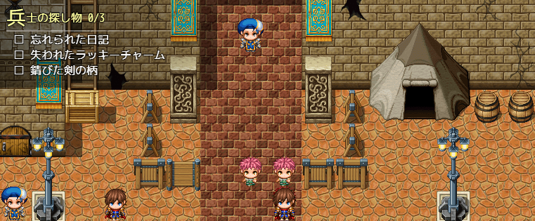</a><a href="Sakura_DestinationBySwitchOn/Sakura_DestinationBySwitchOn.md">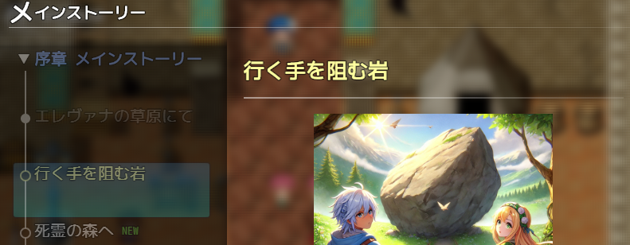</a>                     | 🎉2.1.3     | なし                                                                        | [Sakura_ DestinationBySwitchOn](Sakura_DestinationBySwitchOn/Sakura_DestinationBySwitchOn.md) 🧭スイッチオンで自動的に次の目的を表示                                          |
| <a href="Sakura_MapNameExtend/Sakura_MapNameExtend.md">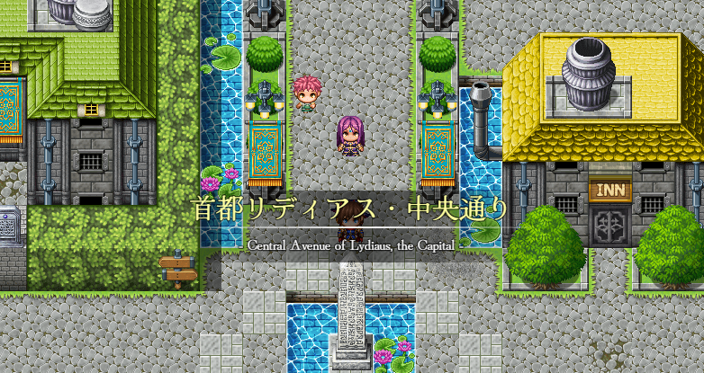</a>                                                                                                                                                              | 🎉1.0.5     | なし                                                                        | [Sakura_ MapNameExtend](Sakura_MapNameExtend/Sakura_MapNameExtend.md) 🗺️マップ名表示をちょっといい感じに！                                                                    |
| <a href="Sakura_MapStatusHud/Sakura_MapStatusHud.md">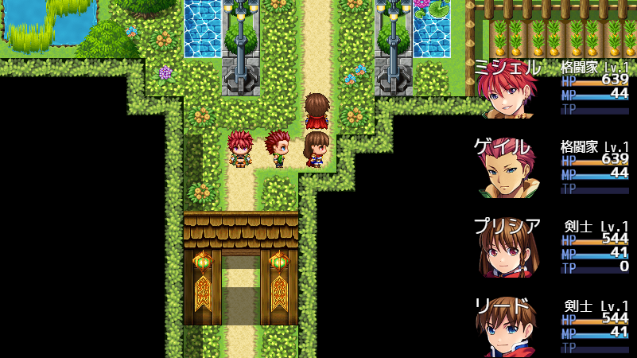</a>                                                                                                                                                                | 🎉1.3.1     | なし                                                                        | [Sakura_ MapStatusHud](Sakura_MapStatusHud/Sakura_MapStatusHud.md)  🍀マップステータス表示                                                                                    |
| <a href="Sakura_EventIndicator/Sakura_EventIndicator.md">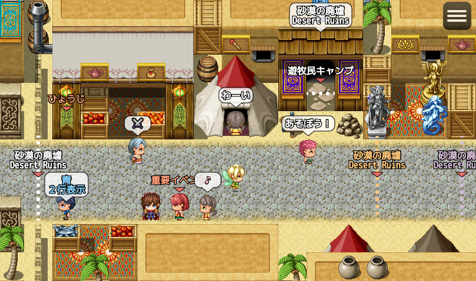</a>                                                                                                                                                            | 🎉1.0.0     | なし                                                                        | [Sakura_ EventIndicator](Sakura_EventIndicator/Sakura_EventIndicator.md)  🔔イベントインジケータ                                                                              |
| <a href="Sakura_SvBattleExtend/Sakura_SvBattleExtend.md">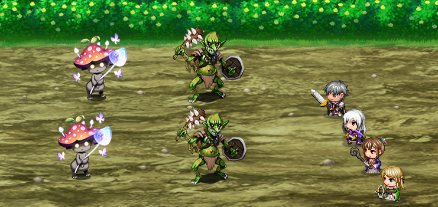</a>                                                                                                                                                            | 🎉1.1.2     | なし                                                                        | [Sakura_ SvBattleExtend](Sakura_SvBattleExtend/Sakura_SvBattleExtend.md)  💥ｻｲﾄﾞﾋﾞｭｰﾊﾞﾄﾙいい感じプラグイン                                                                       |
| <a href="Sakura_SvBattleExtend_WeaponIcon/Sakura_SvBattleExtend_WeaponIcon.md">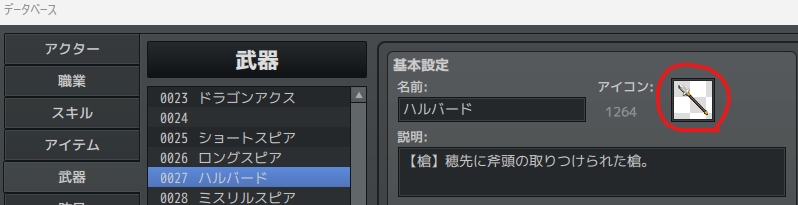</a> <a href="Sakura_SvBattleExtend_WeaponIcon/Sakura_SvBattleExtend_WeaponIcon.md">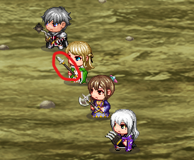</a> | 🎉1.1.0     | [Sakura_ SvBattleExtend](Sakura_SvBattleExtend/Sakura_SvBattleExtend.md) | [Sakura_ SvBattleExtend_WeaponIcon](Sakura_SvBattleExtend_WeaponIcon/Sakura_SvBattleExtend_WeaponIcon.md) 💥-⚔️「Sakura_SvBattleExtend」のサブプラグイン。 武器アイコン表示 |
| <a href="Sakura_EnemyHud/Sakura_EnemyHud.md">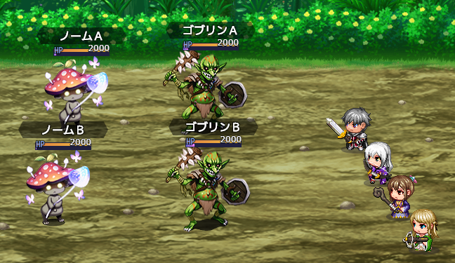</a>                                                                                                                                                                        | 🎉1.1.0     | なし                                                                        | [Sakura_ EnemyHud](Sakura_EnemyHud/Sakura_EnemyHud.md)  ❤️ 敵ステータス表示プラグイン                                                                                         |
| <a href="Sakura_ShowComboDamage/Sakura_ShowComboDamage.md">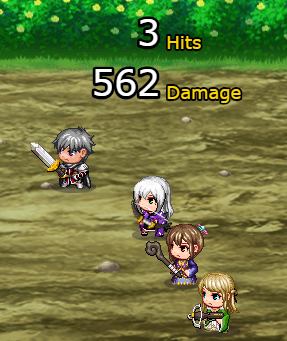</a>                                                                                                                                                          | 🎉1.0.1     | なし                                                                        | [Sakura_ ShowComboDamage](Sakura_ShowComboDamage/Sakura_ShowComboDamage.md)  ✨ コンボダメージ表示プラグイン                                                                  |
| <a href="Sakura_PlayBgmInScene/Sakura_PlayBgmInScene.md">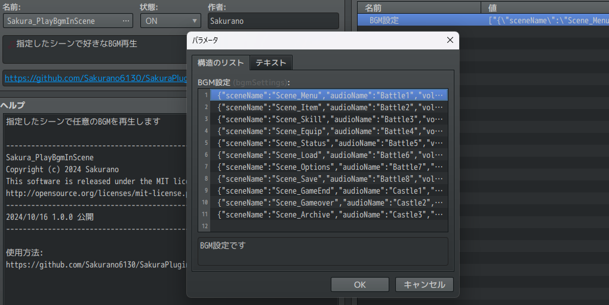</a>                                                                                                                                                            | 🎉1.0.1     | なし                                                                        | [Sakura_ PlayBgmInScene](Sakura_PlayBgmInScene/Sakura_PlayBgmInScene.md)  🎵 指定したシーンで好きなBGM再生                                                                    |
| <a href="Sakura_HintWhenFacingEvent/Sakura_HintWhenFacingEvent.md">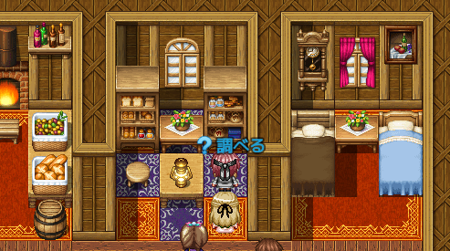</a>                                                                                                                                                  | 🎉1.0.0     | なし                                                                        | [Sakura_ HintWhenFacingEvent](Sakura_HintWhenFacingEvent/Sakura_HintWhenFacingEvent.md)  ❓ ヒント表示プラグイン                                                              |
---
- 画像には一部、AIで生成した画像を含みます。
- 画像には一部、REFMAP様素材を利用させていただいてます。(C) REFMAP
- 『RPGツクールMZ』	©Gotcha Gotcha Games Inc./YOJI OJIMA 2020
