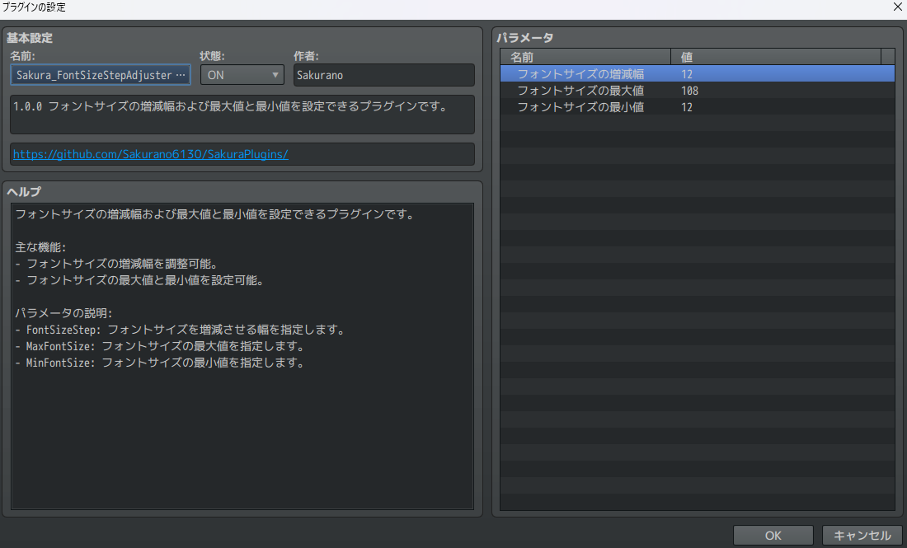
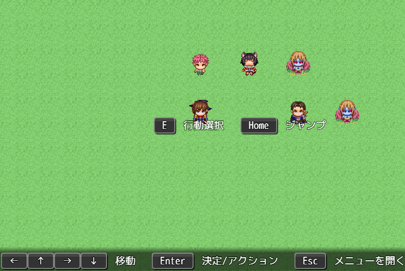
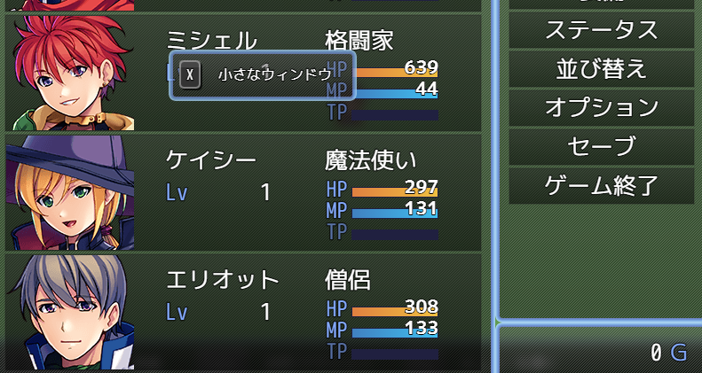
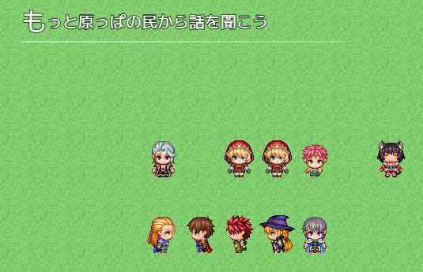
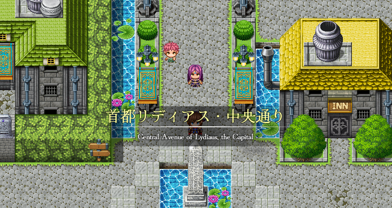
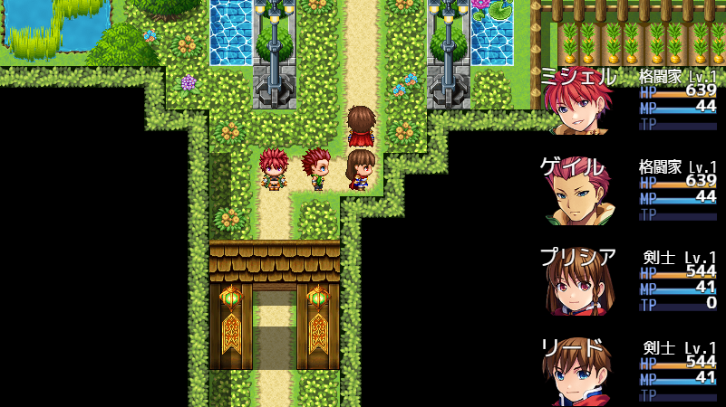
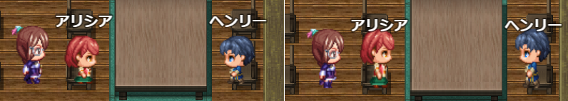

# SakuraPlugins

作成したプラグインを公開します。

| pluginImage                                                                                                         | バージョン | 内容                                                                                                                                                                   |
| ------------------------------------------------------------------------------------------------------------------- | ---------- | ---------------------------------------------------------------------------------------------------------------------------------------------------------------------- |
|                | 🎉1.0.2     | [Sakura_ ShowChapterTitle](Sakura_ShowChapterTitle/Sakura_ShowChapterTitle.md)   🌟章タイトルをサクッと出せる                                                     |
|      | 🎉1.0.1     | [Sakura_ FontSizeStepAdjuster](Sakura_FontSizeStepAdjuster/Sakura_FontSizeStepAdjuster.md) 🔠制御文字`\}` `\{`のフォントサイズ増減幅変えたい                      |
|           | 🎉1.0.1     | [Sakura_ FreeKeyboardGuide](Sakura_FreeKeyboardGuide/Sakura_FreeKeyboardGuide.md) ⌨️キーボードガイドを楽に自由に！                                                |
|  | 🎉1.0.0     | [Sakura_ NonBlockingWindowLayer](Sakura_NonBlockingWindowLayer/Sakura_NonBlockingWindowLayer.md) ✨ウィンドウが重なったとき、後ろのウィンドウを隠さないプラグイン |
|   | 🎉1.0.2     | [Sakura_ DestinationBySwitchOn](Sakura_DestinationBySwitchOn/Sakura_DestinationBySwitchOn.md) 🧭スイッチオンで自動的に次の目的を表示                              |
|                   | 🎉1.0.2     | [Sakura_ MapNameExtend](Sakura_MapNameExtend/Sakura_MapNameExtend.md) 🗺️マップ名表示をちょっといい感じに！                                                        |
|                     | 🎉1.0.0     | [Sakura_ MapStatusHud](Sakura_MapStatusHud/Sakura_MapStatusHud.md)  🍀マップステータス表示                                                                        |
|                                                               | 🚧準備中    | Sakura_ CharacterHeightUp  🚶‍♀️キャラクター頭身アップ                                                                                                               |

---
- 画像には一部、AIで生成した画像を含みます。
- 画像には一部、REFMAP様素材を利用させていただいてます。(C) REFMAP
- 『RPGツクールMZ』	©Gotcha Gotcha Games Inc./YOJI OJIMA 2020
