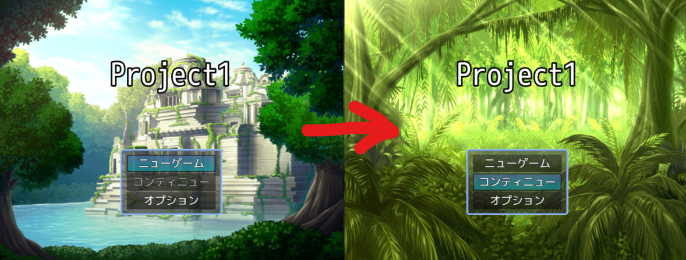
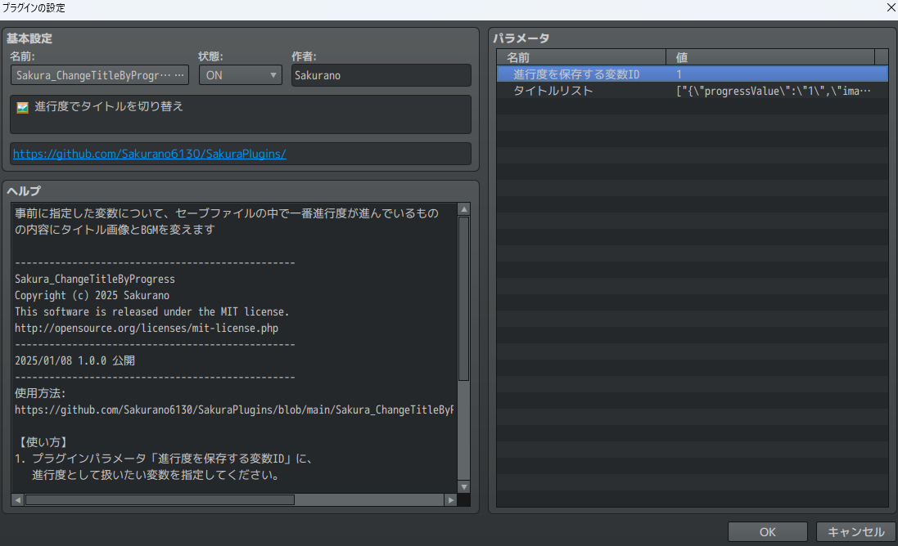
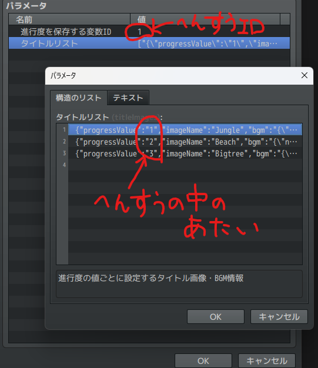

# Sakura_ChangeTitleByProgress
🖼 進行度でタイトルを切り替え

## ダウンロード
[Sakura_ChangeTitleByProgress.js](https://raw.githubusercontent.com/Sakurano6130/SakuraPlugins/main/Sakura_ChangeTitleByProgress/Sakura_ChangeTitleByProgress.js)

## 更新履歴
| ver   | 日付       | 説明 |
| ----- | ---------- | ---- |
| 1.0.0 | 2025/01/08 | 公開 |

## 機能説明
### 全セーブファイルの中で、変数に指定した進行度が一番進んでいるものの内容にタイトル画像とBGMを変えます

### プラグインパラメータ

- **進行度を保存する変数ID**
  - 進行度を保存する変数を指定してください。

- **タイトルリスト**
  - 進行度の値ごとに設定するタイトル画像・BGM情報です。複数選択できます。
    

    - この例だと、`変数1`の中身が、`1`だったら`Jungle`、`2`だったら`Beach`、`3`だったら`Bigtree`になります。
    - BGMもそれぞれ指定できます。

### セーブデータが複数ある場合
  - 進行度が**一番進んでいる**セーブデータの変数の値とプラグインパラメータで指定した内容を比較します。
  - 比較した結果、値が合うものがない場合は、元々のタイトルになります。

# License
- This software is released under the MIT license. http://opensource.org/licenses/mit-license.php
