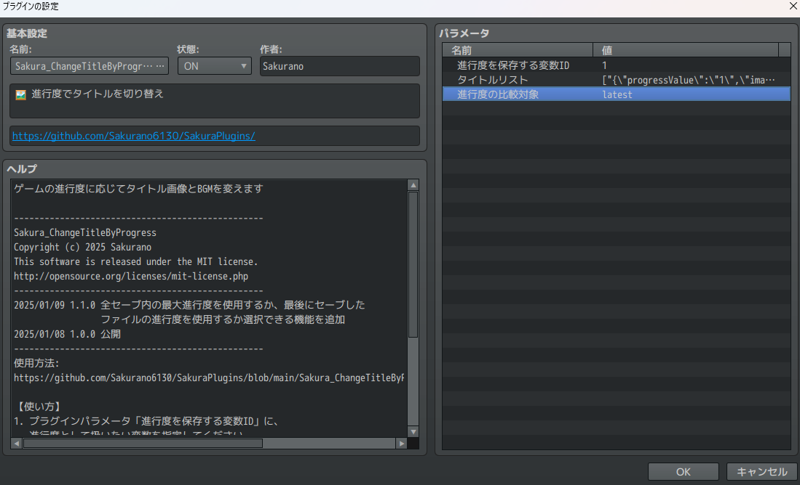
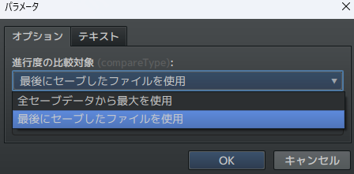

# Sakura_ChangeTitleByProgress
🖼 進行度でタイトルを切り替え

## ダウンロード
[Sakura_ChangeTitleByProgress.js](https://raw.githubusercontent.com/Sakurano6130/SakuraPlugins/main/Sakura_ChangeTitleByProgress/Sakura_ChangeTitleByProgress.js)

## 更新履歴
| ver   | 日付       | 説明                                                                                                 |
| ----- | ---------- | ---------------------------------------------------------------------------------------------------- |
| 1.1.0 | 2025/01/09 | 全セーブ内の最大進行度を使用するか、最後にセーブしたファイルの進行度を使用するか選択できる機能を追加 |
| 1.0.0 | 2025/01/08 | 公開                                                                                                 |

## 機能説明
### ゲームの進行度に応じてタイトル画像とBGMを変えます

### プラグインパラメータ

- **進行度を保存する変数ID**
  - 進行度を保存する変数を指定してください。

- **タイトルリスト**
  - 進行度の値ごとに設定するタイトル画像・BGM情報です。複数選択できます。
    

    - この例だと、`変数1`の中身が、`1`だったら`Jungle`、`2`だったら`Beach`、`3`だったら`Bigtree`になります。
    - BGMもそれぞれ指定できます。

- **進行度の比較対象** `ver.1.1`
  - 進行度を「全セーブの最大値」にするか「最後にセーブしたファイル」にするかを選択できます。
  
    

### 比較した結果、値が合うものがない場合
  - 元々のタイトルになります。

# License
- This software is released under the MIT license. http://opensource.org/licenses/mit-license.php
