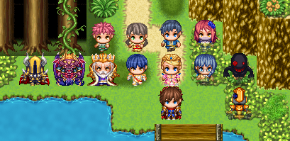
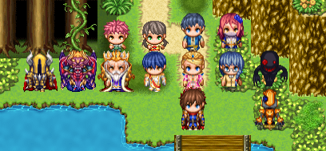
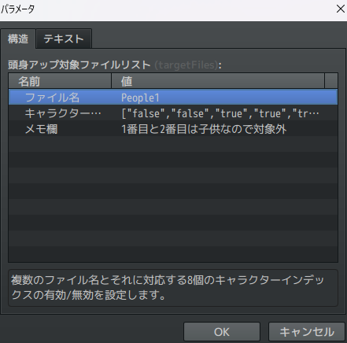
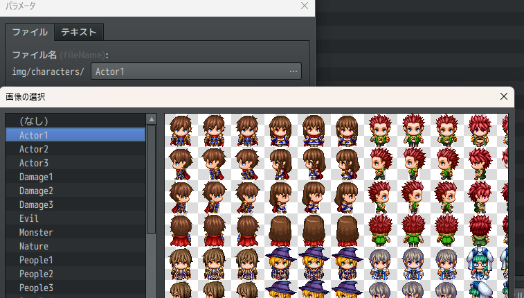
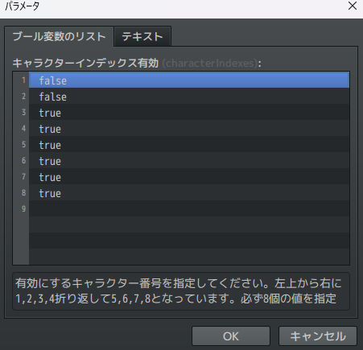
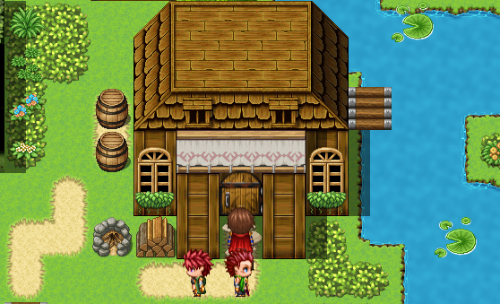

# Sakura_ChatacterHeightUp
キャラクターの頭身をアップします。

## 適用前

## 適用後

## ダウンロード
[Sakura_ChatacterHeightUp.js](https://raw.githubusercontent.com/Sakurano6130/SakuraPlugins/main/Sakura_ChatacterHeightUp/Sakura_ChatacterHeightUp.js)

## 更新履歴
| ver   | 日付       | 説明 |
| ----- | ---------- | ---- |
| 1.0.0 | 2024/09/06 | 公開 |

## 機能概要
- キャラクターの頭身をアップします。
  
  
## プラグインパラメータの説明
- **targetFiles**
  - 頭身アップを適用するキャラクター画像ファイルのリスト。
    
    

    

    - ファイル名
  
      適用したいファイルを指定してください。

       

    - キャラクターインデックス

      8個のキャラクターインデックスに対して、頭身アップの有効/無効を設定します。trueで有効、falseで無効。RPGツクールMZでは、左上から1～4、下段に5～8の順でインデックスが割り振られています。
  
      

    - メモ欄

      メモ欄です。ここには自由にメモを記載できます。このメモは処理には使用されません。子供だから対象外にしたことなどをメモしておくのに使ってください。
  

- **scaleUp**
  頭身アップの倍率を設定します。1.0～2.0の範囲で設定可能。1.5～1.8くらいがいいと思います。

---

ドアも引き延ばせます。

---
### 注意
- このプラグインは、もともとのキャラクター描画の方法を変えていますので、プラグイン間の競合が起きるかもしれません。

# License
- This software is released under the MIT license. http://opensource.org/licenses/mit-license.php
