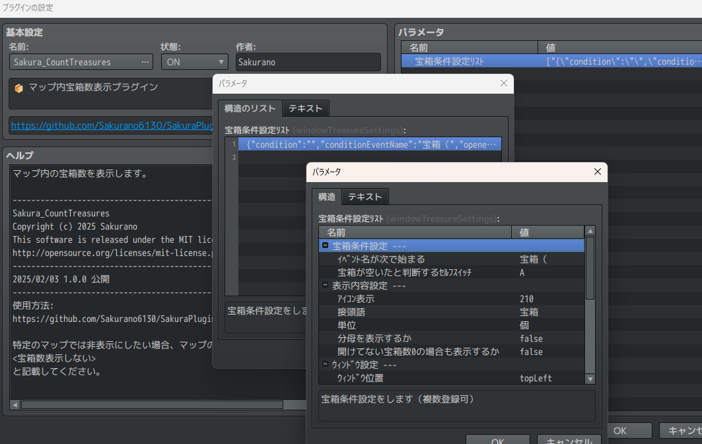

# Sakura_CountTreasures
📦 マップ内宝箱数表示プラグイン

## ダウンロード
[Sakura_CountTreasures.js](https://raw.githubusercontent.com/Sakurano6130/SakuraPlugins/main/Sakura_CountTreasures/Sakura_CountTreasures.js)

## 更新履歴
| ver   | 日付       | 説明 |
| ----- | ---------- | ---- |
| 1.0.0 | 2025/02/03 | 公開 |

## 機能説明
### マップ内の宝箱数を表示します

### プラグインパラメータ

## 宝箱数表示ウィンドウは、条件ごとに複数作成できます。

## 宝箱条件設定
### ｲﾍﾞﾝﾄ名が次で始まる
- ｲﾍﾞﾝﾄ名がここで指定した文字で始まる場合、宝箱とみなします

### 宝箱が空いたと判断するｾﾙﾌｽｲｯﾁ
- ここで指定したｾﾙﾌｽｲｯﾁがｵﾝのとき、宝箱が空いているとみなします

## 表示内容設定
### ｱｲｺﾝ表示
- 表示するｱｲｺﾝを指定してください。(なしで非表示)

### 接頭語
- 宝箱数の数字の前につける言葉を指定してください。(なしで非表示)

### 単位
- 宝箱数の数字の後につける言葉を指定してください。(なしで非表示)

### 分母を表示するか
- 分母も表示したい場合はｵﾝにしてください。

### 開けてない宝箱数0の場合も表示するか
- 開けてない宝箱数0の場合でも表示したい場合はｵﾝにしてください。

## ｳｨﾝﾄﾞｳ設定
### ｳｨﾝﾄﾞｳ位置
- 宝箱数ｳｨﾝﾄﾞｳの画面内の位置を指定します。
  - `左上`, `右上`, `左下`, `右下`のいずれかです。

### ｳｨﾝﾄﾞｳXｵﾌｾｯﾄ
- 宝箱数ｳｨﾝﾄﾞｳのX軸のｵﾌｾｯﾄ。正の値で右に、負の値で左に移動します。

### ｳｨﾝﾄﾞｳYｵﾌｾｯﾄ
- 宝箱数ｳｨﾝﾄﾞｳのY軸のｵﾌｾｯﾄ。正の値で下に、負の値で上に移動します。

### ｳｨﾝﾄﾞｳ幅
- 宝箱数ｳｨﾝﾄﾞｳの幅を指定してください。

### ｳｨﾝﾄﾞｳ高さ
- 宝箱数ｳｨﾝﾄﾞｳの高さを指定してください。

### ｳｨﾝﾄﾞｳの透明度
- 宝箱数ｳｨﾝﾄﾞｳの背景の透明度を指定して下さい。

### ｳｨﾝﾄﾞｳの背景暗くするか
- ｳｨﾝﾄﾞｳの背景を暗くするかどうかを指定してください。

### ﾌｫﾝﾄｻｲｽﾞ
- ﾌｫﾝﾄｻｲｽﾞです。

### 文字の色
- 文字の色です。（\C[番号]に相当）

## 表示/非表示設定
### 表示するｽｲｯﾁ
- ここで指定したｽｲｯﾁがｵﾝのとき、宝箱数ｳｨﾝﾄﾞｳが表示されます。指定しない場合は常に表示されます。

### ﾏｯﾌﾟが変わった時にこのｽｲｯﾁを自動ｵﾌするか
- ﾏｯﾌﾟが切り替わる際に自動でこのｽｲｯﾁをｵﾌにするかどうかを指定してください。
  - 【使い方】特定のスキルを使うと宝箱ウィンドウが表示され、マップが切り替わると表示が消える　というような使い方を想定しています。

### ｲﾍﾞﾝﾄ実行中も表示するか
- ｲﾍﾞﾝﾄ実行中も表示したい場合はｵﾝにしてください。

---
### このページで使用しているアイコンについて

yanfly様のアイコンを使用しています。

[http://yanfly.moe/2015/10/23/freebies-mv-ready-ace-icons/](http://yanfly.moe/2015/10/23/freebies-mv-ready-ace-icons/)

# License
- This software is released under the MIT license. http://opensource.org/licenses/mit-license.php
