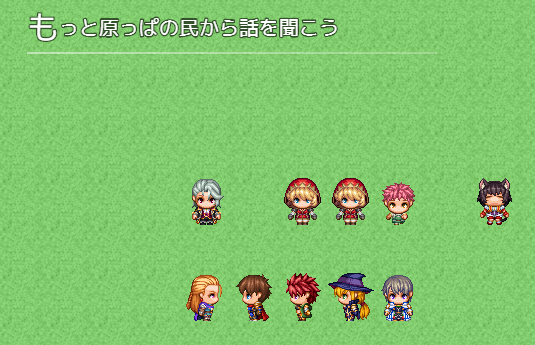
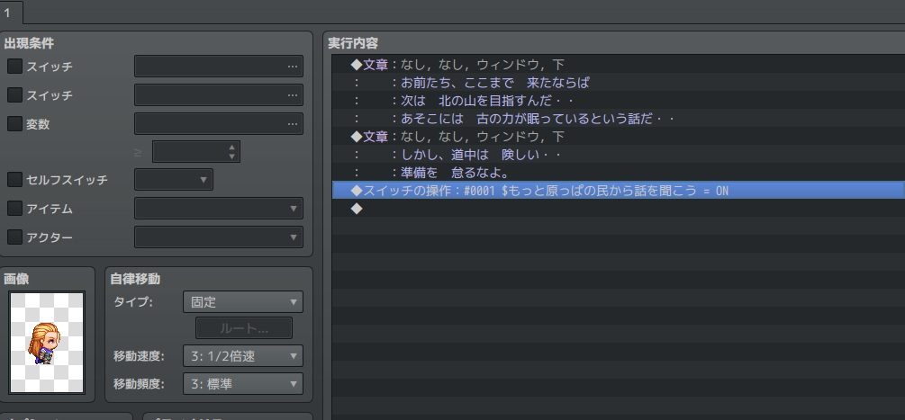
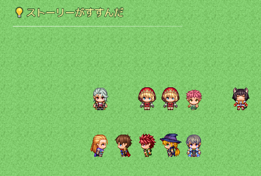
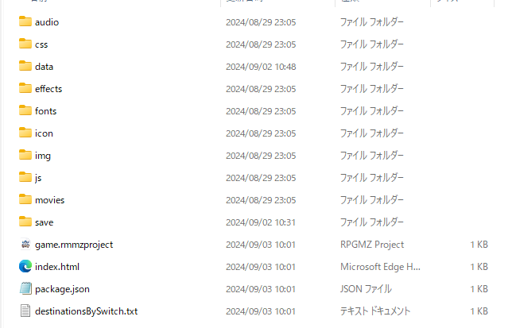
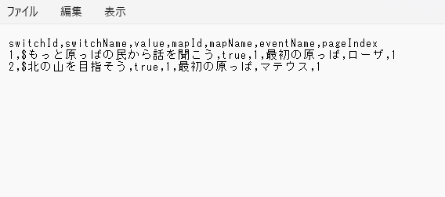
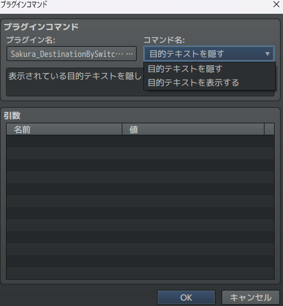

# Sakura_DestinationBySwitchOn
スイッチオンで次の目的表示

## ダウンロード
[Sakura_DestinationBySwitchOn.js](Sakura_DestinationBySwitchOn.js)

## 更新履歴
| ver   | 日付       | 説明                                             |
| ----- | ---------- | ------------------------------------------------ |
| 1.0.2 | 2024/09/04 | ファイル出力判定ミス修正                         |
| 1.0.1 | 2024/09/03 | 初期表示時に後ろのウィンドウを隠さないように修正 |
| 1.0.0 | 2024/09/03 | 公開                                             |

## 機能概要
- スイッチの名前が`$`で始まるものが`オン`になったとき、そのスイッチの名前を自動的に次の目的として表示します。
  

## プラグインパラメータ
- **destinationPosition**
  - 目的を表示する位置です。左上、右上、左下、右下から選べます。

- **destinationTextX**
  - 目的を表示する位置のX軸補正です。

- **destinationTextY**
  - 目的を表示する位置のY軸補正です。

- **fontSize**
  - 目的を表示するフォントサイズです。

- **storyProgressText**
  - 目的が変わった時に差し込む言葉です。指定しなかった場合は表示されません。
   
  

- **storyProgressTextColor**
  - 目的が変わった時に差し込む言葉の色です。
  
- **needsOutputDestinations**
  - 目的をファイルに書き込むかどうか。これをtrueにして、テストプレイを実行するとプロジェクトフォルダ直下に「destinationsBySwitch.txt」というファイルが出力されます。
  - どのマップのどのイベントのどのページでオン、オフしたのかをカンマ区切りのデータにして出力します。わけわからなくならないように付けた機能です。
  
  

  

## プラグインコマンドの使用

プラグインコマンドから、以下の2つを使用できます。

# License
- This software is released under the MIT license. http://opensource.org/licenses/mit-license.php
