# Sakura_DestinationBySwitchOn
### スイッチオンで次の目的表示

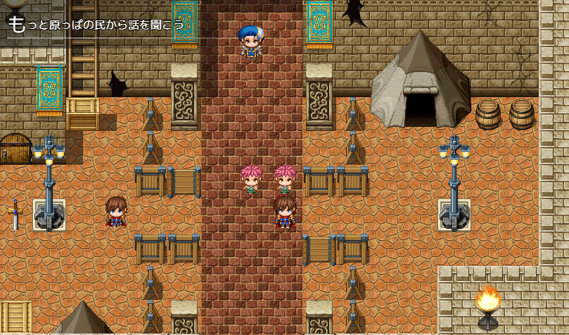

### 子目的も表示できる `ver.2.0`

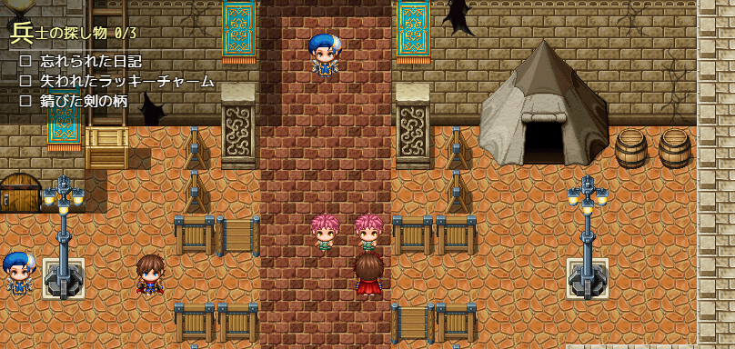

### 目的表示シーンを表示できる。目的表示シーンにはテキストだけでなくピクチャ表示もできる。 `ver.2.0`

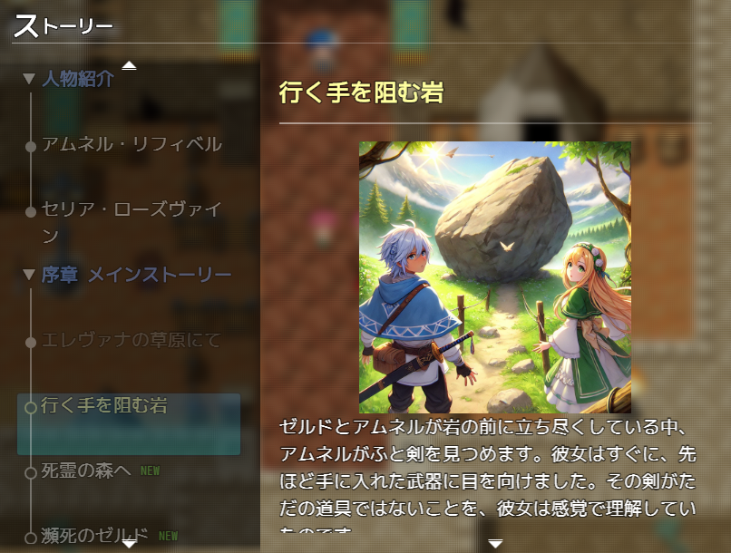

### ゲーム内で撮ったスクリーンショットを目的表示シーンのピクチャ画像にできる `ver.2.0`

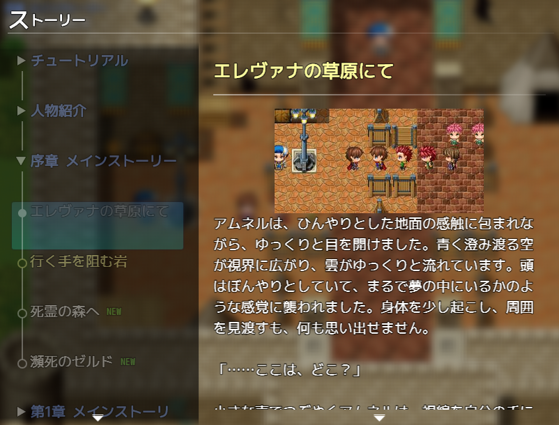

## ダウンロード
[Sakura_DestinationBySwitchOn.js](https://raw.githubusercontent.com/Sakurano6130/SakuraPlugins/main/Sakura_DestinationBySwitchOn/Sakura_DestinationBySwitchOn.js)

## 更新履歴
| ver   | 日付       | 説明                                                                                                 |
| ----- | ---------- | ---------------------------------------------------------------------------------------------------- |
| 2.0.0 | 2024/09/17 | 子目的表示の追加 目的表示シーンの追加                                                             |
| 1.0.3 | 2024/09/09 | ツクールのシステム設定で、画面の幅・高さとUIエリアの幅・高さが異なる設定をしている場合の位置を調整。 |
| 1.0.2 | 2024/09/04 | ファイル出力判定ミス修正                                                                             |
| 1.0.1 | 2024/09/03 | 初期表示時に後ろのウィンドウを隠さないように修正                                                     |
| 1.0.0 | 2024/09/03 | 公開                                                                                                 |

## 機能説明

### スイッチの名前が`$`で始まるものが`オン`になったとき、そのスイッチの名前を自動的に次の目的として表示します。
  

### スイッチの名前が `@親=親のスイッチ` で始まるものをスイッチに登録しておくと、そのスイッチが自動的に子目的になって表示されます。`ver.2.0`
  
  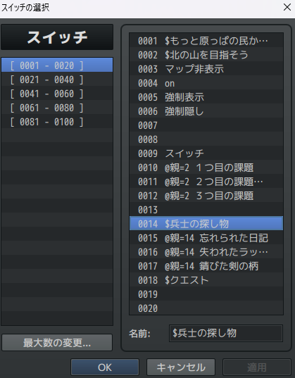

  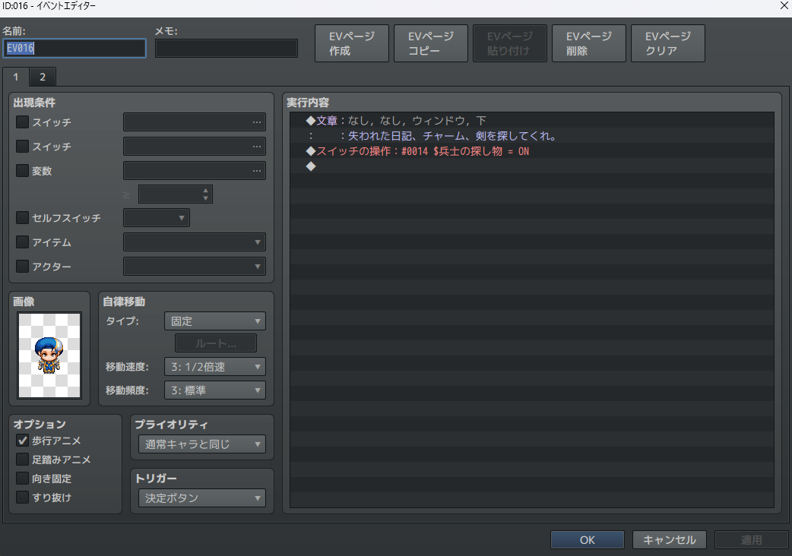

  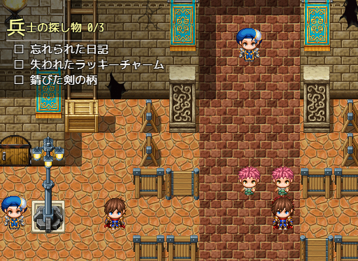

  子目的のスイッチがオンになると、自動でチェックがついて進捗が上がります。

  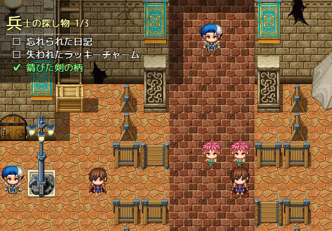

###  ここまでの機能でよければ、ここまでで大丈夫です。以下は、目的表示シーンを表示する機能の説明です。（ちょっと複雑です...）

---

### **コモンイベント** で プラグインコマンド **「目的登録」** をしておくと、目的表示シーンで目的の一覧を表示することができます。`ver.2.0`

  
  - ゲーム起動時に自動的にコモンイベントの中を検索して読み込むので、このコモンイベントは実行する必要ありません。トリガーは「なし」でよいです。
  - どのコモンイベントのどこにおいても大丈夫ですが、目的表示シーンで表示される順番はコモンイベントに置いた順になります。
  - １つのコモンイベントの中に全部を書いても良いし、別々のコモンイベントに分けて書いても良いです。

    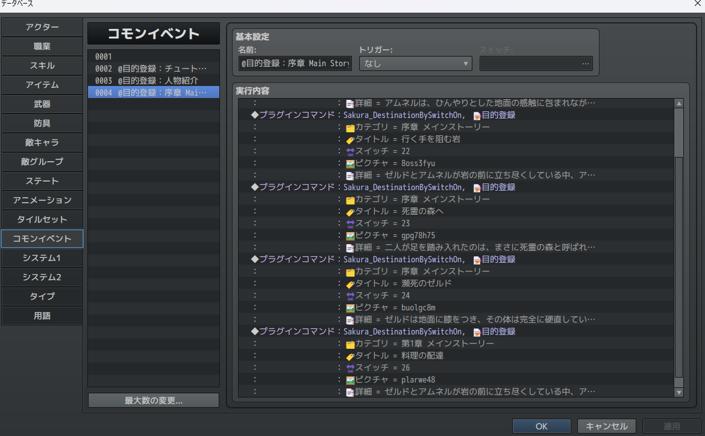

  - プラグインコマンド **「目的登録」** で、カテゴリ、タイトル、スイッチ、ピクチャ、詳細を設定してください。

    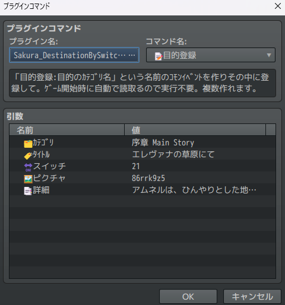

  - カテゴリ設定です。このカテゴリごとに目的表示シーンで折り畳み表示されます。

    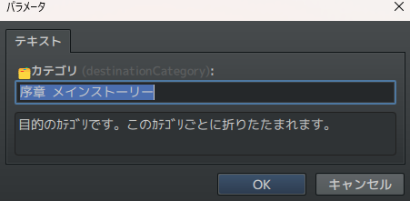

  - 目的のタイトルを設定してください。

    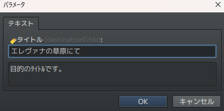

  - 紐づけるスイッチを指定してください。指定するとオンの時のみ表示されるようになります。指定しない場合は、常に表示されます。ここではスイッチ名に$がついていないものも指定できます。

    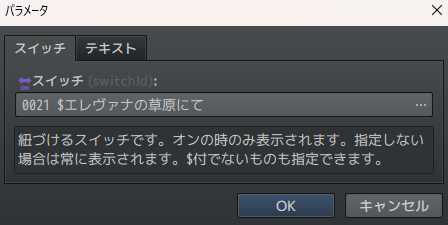

  - 表示したいピクチャを指定してください。

    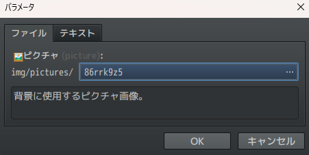

  - 詳細文章を記載してください。横は自動でウィンドウ幅に合わせて改行されます。縦に長い場合はスクロールします。縦の長さの限界は、プラグインパラメータの「detailWindowMaxContentsHeight」で設定できます。（デフォルト10000px）

    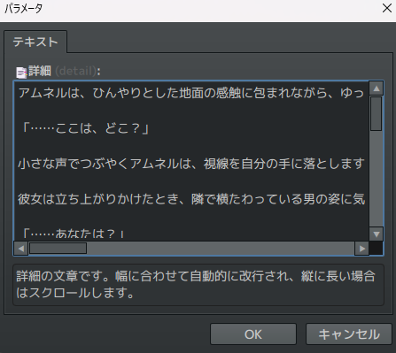

    上記の通り設定しておくと、以下のようになります。

    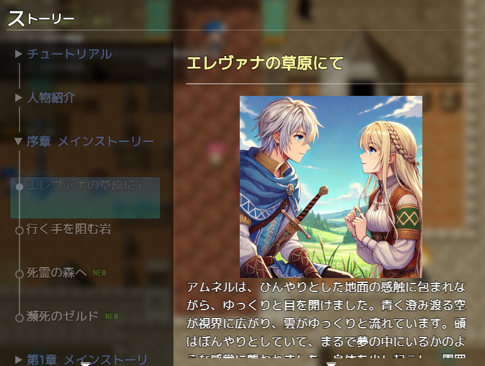

---

## 目的表示シーンを呼び出す方法 `ver.2.0`

2つ方法があります。
### ①プラグインコマンドから呼び出す
### ②プラグインパラメータでメニューコマンドに登録する

---

### ①プラグインコマンドから呼び出す

  - プラグインコマンドの「目的表示シーンの呼び出し」で呼び出せます。
  - このとき、シーンの左上に大きく出るタイトルと、表示する対象のカテゴリ（前方一致検索・複数指定可）を設定できます。
  - カテゴリを指定しなかった場合は、コモンイベントに登録した全ての目的が対象となります。
  - 注）目的にスイッチが紐づけられている場合は、そのスイッチがオンにならないと表示されません。

    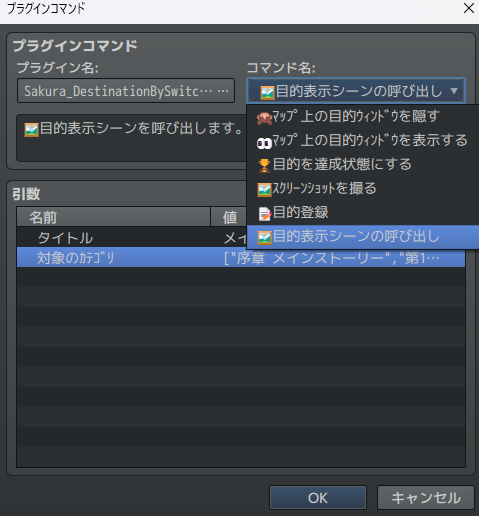

    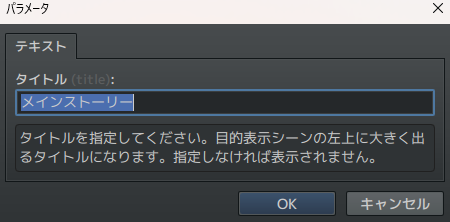

    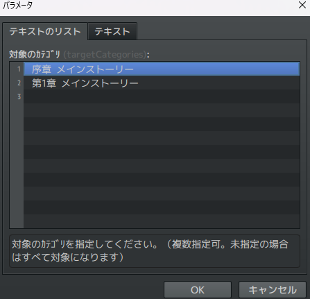

- イメージはこんな感じです。

    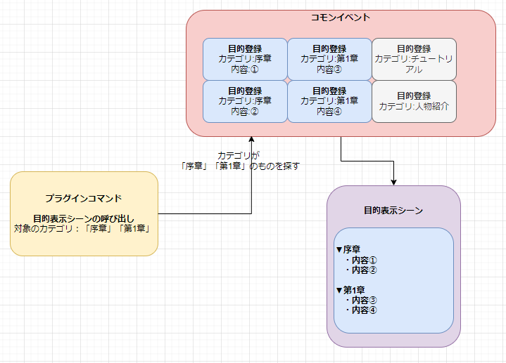

### ②プラグインパラメータでメニューコマンドに登録する

  - デフォルトのメニュー画面にコマンドを追加することができます。(並び替えとオプションの間)
    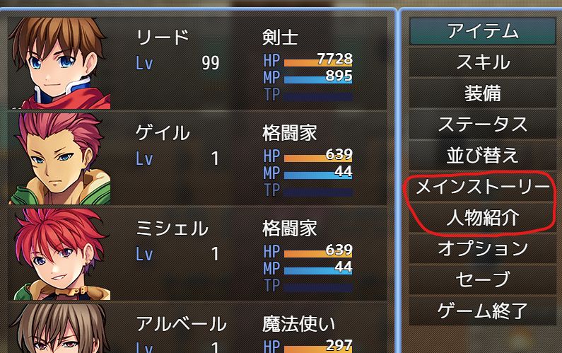

  - プラグインパラメータ設定画面の「ﾒﾆｭｰｺﾏﾝﾄﾞ設定」から設定できます。
    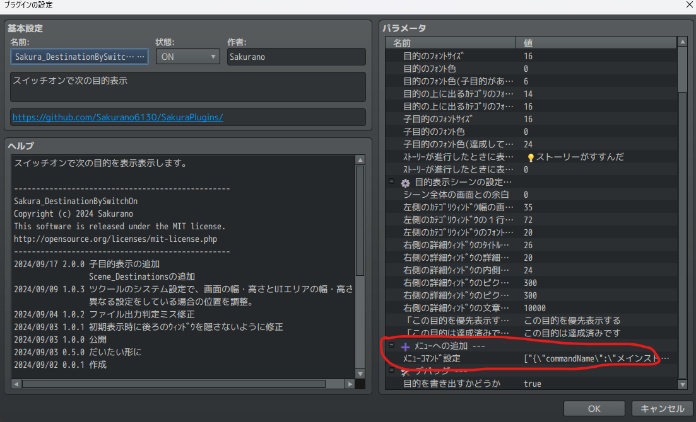

  - 指定したカテゴリごとに独立した別のコマンドとして複数設定することもできます。なので、チュートリアルのようなカテゴリだけの目的のシーンや、登場人物紹介、書物内容といったシーンを作ることもできます。

    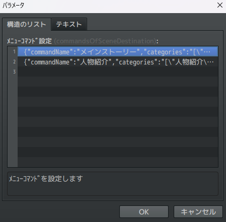

  - コマンド名、対象のカテゴリ（前方一致検索・複数指定可）を指定してください。
  - カテゴリを指定しなかった場合は、コモンイベントに登録した全ての目的が対象となります。
  - 注）目的にスイッチが紐づけられている場合は、そのスイッチがオンにならないと表示されません。

    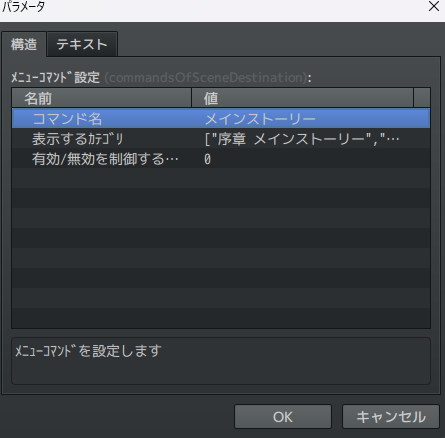

    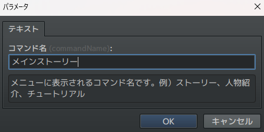

    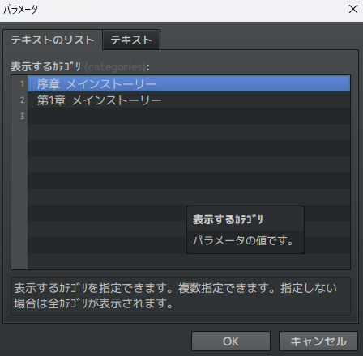

  - 有効/無効を制御するスイッチID：このスイッチがオンになっていない場合は、コマンドが非活性になりメニューから呼び出すことができません。ストーリーが進むと解放されるメニューコマンドのような演出にご利用ください。

    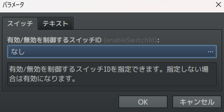

## プラグインパラメータ
### 📍 ﾏｯﾌﾟ上の目的表示の設定

- **destinationPosition**
  - 目的を表示する位置です。左上、右上、左下、右下から選べます。

- **destinationTextX**
  - 目的を表示する位置のX軸補正です。

- **destinationTextY**
  - 目的を表示する位置のY軸補正です。

- **destinationFontSize**
  - 目的を表示するフォントサイズです。

- **destinationFontColor** `ver.2.0`
  - 目的のﾌｫﾝﾄ色です。

- **destinationFontColorIfHasChildren** `ver.2.0`
  - 目的のﾌｫﾝﾄ色(子目的がある場合)です。

- **categoryFontSize** `ver.2.0`
  - 目的の上に出るｶﾃｺﾞﾘのﾌｫﾝﾄｻｲｽﾞです。

- **categoryFontColor** `ver.2.0`
  - 目的の上に出るｶﾃｺﾞﾘのﾌｫﾝﾄ色です。

- **childrenFontSize** `ver.2.0`
  - 子目的のﾌｫﾝﾄｻｲｽﾞです。

- **childrenFontColor** `ver.2.0`
  - 子目的のﾌｫﾝﾄ色です。

- **childrenFontColorIfCompleted** `ver.2.0`
  - 子目的のﾌｫﾝﾄ色(達成している場合)です。

- **storyProgressText**
  - 目的が変わった時に差し込む言葉です。指定しなかった場合は表示されません。
   
  

- **storyProgressTextColor**
  - 目的が変わった時に差し込む言葉の色です。

---

### ⚙️ 目的表示シーンの設定 `ver.2.0`

- **paddingInSceneDestination** `ver.2.0`
  - シーン全体の画面との余白です。

- **listWindowWidthRate** `ver.2.0`
  - 左側のｶﾃｺﾞﾘｳｨﾝﾄﾞｳ幅の画面に対する大きさ（％）です。

- **listWindowItemHeight** `ver.2.0`
  - 左側のｶﾃｺﾞﾘｳｨﾝﾄﾞｳの１行の高さです。

- **listWindowFontSize** `ver.2.0`
  - 左側のｶﾃｺﾞﾘｳｨﾝﾄﾞｳのﾌｫﾝﾄｻｲｽﾞです。

- **detailWindowTitleFontSize** `ver.2.0`
  - 右側の詳細ｳｨﾝﾄﾞｳのﾀｲﾄﾙのﾌｫﾝﾄｻｲｽﾞです。

- **detailWindowPadding** `ver.2.0`
  - 右側の詳細ｳｨﾝﾄﾞｳの内側の余白です。

- **detailWindowPictureWidth** `ver.2.0`
  - 右側の詳細ｳｨﾝﾄﾞｳのピクチャの幅です。

- **detailWindowPictureHeight** `ver.2.0`
  - 右側の詳細ｳｨﾝﾄﾞｳのピクチャの高さです。

- **detailWindowMaxContentsHeight** `ver.2.0`
  - 右側の詳細ｳｨﾝﾄﾞｳの文章の最大高さ(px)（高くするほど長い文章を表示できますが重くなります）

- **commandWindowTextSetPriority** `ver.2.0`
  - 「この目的を優先表示する」の言葉を変更します

- **commandWindowTextAlreadyCompleted** `ver.2.0`
  - 「この目的は達成済みです」の言葉を変更します

---
### ➕ ﾒﾆｭｰへの追加 `ver.2.0`

  上記、目的表示シーンを呼び出す方法 > ②プラグインパラメータでメニューコマンドに登録する を参照ください。

---
- **needsOutputDestinations**
  - 目的をファイルに書き込むかどうか。これをtrueにして、テストプレイを実行するとプロジェクトフォルダ直下に「destinationsBySwitch.txt」というファイルが出力されます。
  - スイッチの親子関係を表にしたテキストファイルを出力します。`ver.2.0`
  
  

  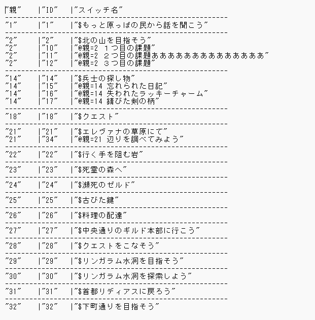

## プラグインコマンドの使用

プラグインコマンドから、以下を使用できます。

- マップ上の目的ウィンドウを隠す
  
  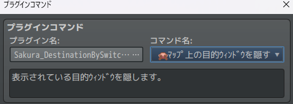

- マップ上の目的ウィンドウを表示する
  
  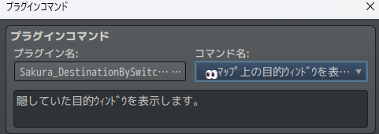

- 目的を達成状態にする

  目的を達成状態にすることで、目的表示シーンで「優先表示」を選択できないようにします。

  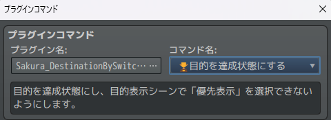

### スクリーンショット機能

ゲーム内のスクリーンショットを撮って、目的表示画面のピクチャに設定することができます。このコマンドを実行すると元々のピクチャ表示設定ではなく、スクリーンショットの方が表示されるようになります。便利機能ですがその分、セーブデータの容量が大きくなるため、セーブデータの容量が大きくなっても問題ない作品のみでご使用ください。

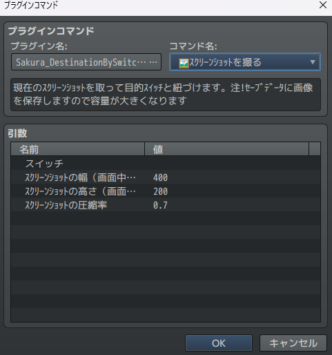

# License
- This software is released under the MIT license. http://opensource.org/licenses/mit-license.php
