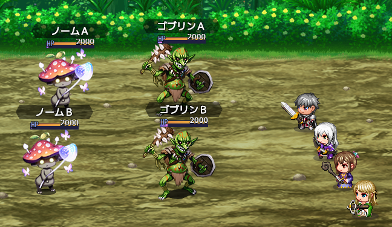
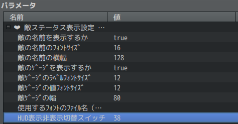

# Sakura_EnemyHud
❤️ 敵ステータス表示プラグイン

## ダウンロード
[Sakura_EnemyHud.js](https://raw.githubusercontent.com/Sakurano6130/SakuraPlugins/main/Sakura_EnemyHud/Sakura_EnemyHud.js)

## 更新履歴
| ver   | 日付       | 説明                                                                                                          |
| ----- | ---------- | ------------------------------------------------------------------------------------------------------------- |
| 1.2.0 | 2025/03/07 | HUD表示非表示切り替えスイッチの追加                                                                           |
| 1.1.1 | 2024/12/10 | 途中から出現する場合、出現してからHUDが表示されるように修正                                                   |
| 1.1.0 | 2024/11/11 | トリアコンタン様の `BattlerGraphicExtend.js` でバトラーの拡大・縮小をしていたときに位置が調整されるように対応 |
| 1.0.0 | 2024/10/07 | 公開                                                                                                          |

## 機能概要

戦闘中に敵の名前とステータスを表示します。

## プラグインパラメータの説明

- **showEnemyName** 
  - 敵の名前を表示するかです

- **enemyNameFontSize** 
  - 敵の名前のﾌｫﾝﾄｻｲｽﾞです

- **enemyNameWidth** 
  - 敵の名前の横幅です

- **enemyGaugeLabelFontSize** 
  - 敵ｹﾞｰｼﾞのﾗﾍﾞﾙﾌｫﾝﾄｻｲｽﾞです

- **enemyGaugeValueFontSize** 
  - 敵ｹﾞｰｼﾞの値ﾌｫﾝﾄｻｲｽﾞです

- **enemyGaugeWidth** 
  - 敵ｹﾞｰｼﾞの幅です

- **fontFile** 
  - 使用するﾌｫﾝﾄのﾌｧｲﾙ名（拡張子.ttfまで含みます）
  - 注）プロジェクトフォルダの`fonts`フォルダに拡張子`.ttf`のファイルを入れてください。

- **showSwitchId** `v1.2`
  - HUD表示非表示切り替えスイッチです。
  - ここで指定したｽｲｯﾁがｵﾝのときのみに表示されるようになります。指定しない場合は常に表示されます。

## プラグインコマンドはありません

# License
- This software is released under the MIT license. http://opensource.org/licenses/mit-license.php
