# Sakura_EventIndicator
イベントに色々なインジケータを表示します。

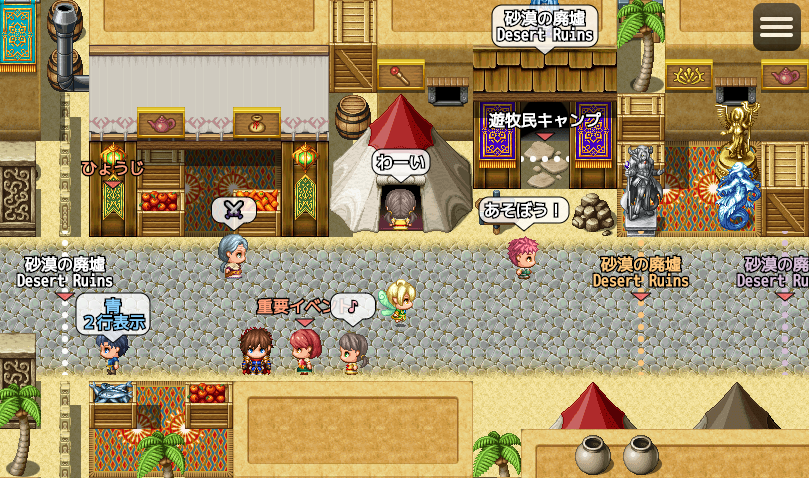

## ダウンロード
[Sakura_EventIndicator.js](https://raw.githubusercontent.com/Sakurano6130/SakuraPlugins/main/Sakura_EventIndicator/Sakura_EventIndicator.js)

## 更新履歴
| ver   | 日付       | 説明 |
| ----- | ---------- | ---- |
| 1.0.0 | 2024/09/11 | 公開 |


## 機能概要
- イベントのメモ欄に以下の記述をすると、色々なインジケータを表示。

### カッコ`（` `）`で囲むと、フキダシ表示

メモ欄記述例）

```
（ｶｯｺで囲むとﾌｷﾀﾞｼに）
```


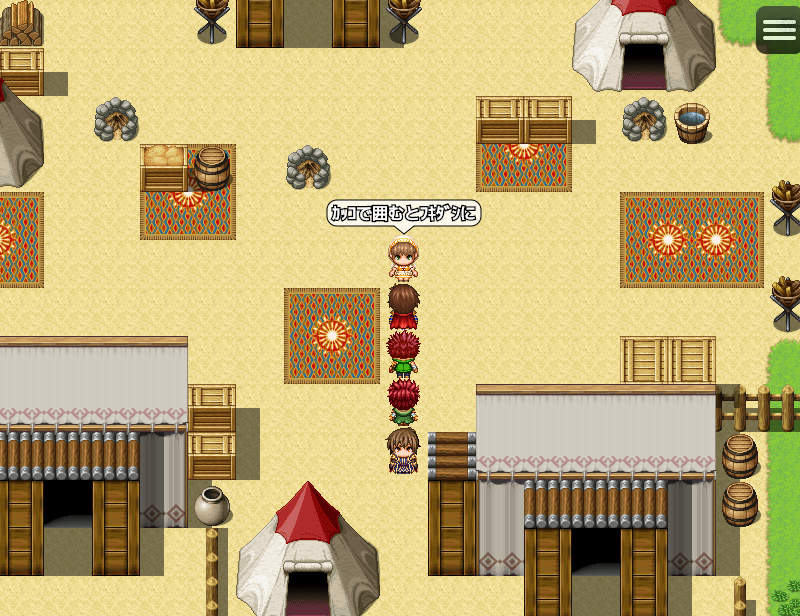

カッコは全角でも半角でも大丈夫。ただしカッコはじめと終わりは全角同士、半角同士じゃないとだめです。

---

### カギカッコ`「` `」`で囲むと、下向き▼表示

メモ欄記述例）
```
「ｶｷﾞｶｯｺで囲むと下向き▼」
```


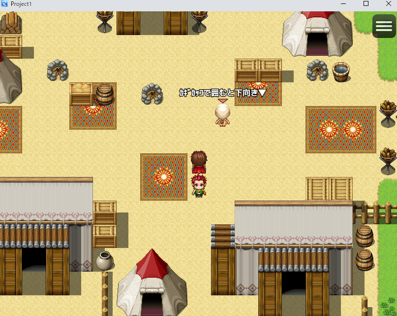


### 色名を書くと、色が変えられる

使える色は、`赤`、`青`、`緑`、`ピンク`、`紫`、`黄`、`オレンジ`

メモ欄記述例）
```
赤（任意の文字）
```
```
青「任意の文字」
```


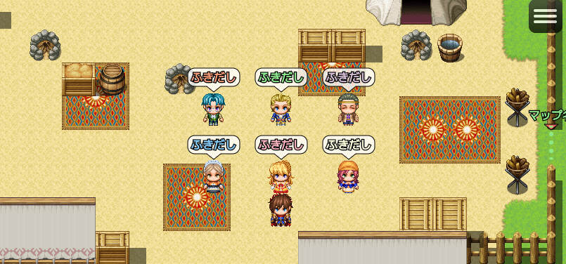

---

### 線の描画と接触範囲拡張

- `横線`または`縦線`と書くと、線が表示されプレイヤーとの接触範囲が拡張される。
- その後ろに数字を書くと、その長さの分、線が伸びる。数字を書かないと画面いっぱいに伸びる。０だとそのイベントのマスだけ線を引く。数字は全角でも半角でも大丈夫。
- `横`または`縦`のように`線`を書かないと、線が表示されずに、接触範囲だけが拡張される。
- その後ろに`「\移動先」`と書くと、イベントの中の場所移動コマンドを読み取って移動先のマップ表示名（なければマップ名）を表示する
- マップ表示名に`|`がある場合は、改行する。
  
メモ欄記述例）

```
横線１ 「\移動先」
```
```
縦線０ 赤「\移動先」
```
```
横１
```
```
縦　「任意の文字列」
```


  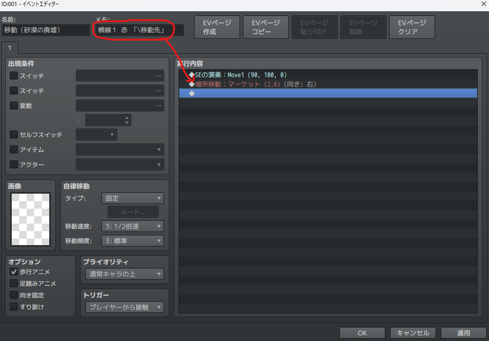

  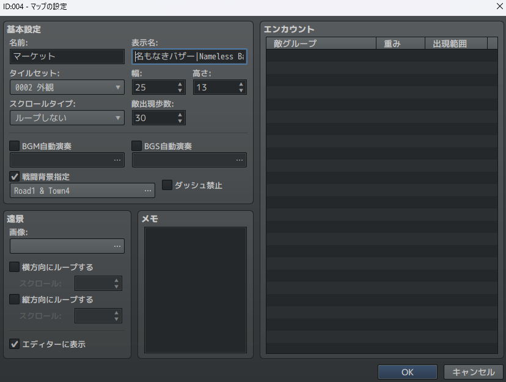

  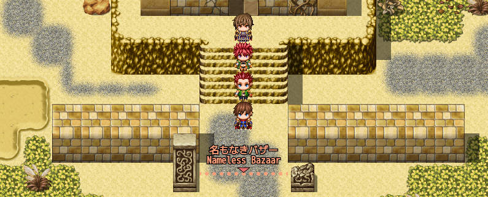


## プラグインコマンドの説明

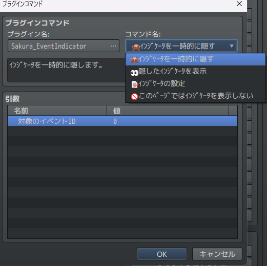

- **🙈ｲﾝｼﾞｹｰﾀを一時的に隠す** 
  - ｲﾝｼﾞｹｰﾀを一時的に隠します。

- **👀隠したｲﾝｼﾞｹｰﾀを表示** 
  - 隠したｲﾝｼﾞｹｰﾀを表示します。

- **📝ｲﾝｼﾞｹｰﾀの設定** 
  - ｲﾝｼﾞｹｰﾀをメモ欄ではなくイベントの中で設定します。
  - イベントの途中で内容を変えたい場合はこちらを利用ください。
  - 対象のイベントIDに-1を指定すると、プレイヤーにもフキダシを出せます。

    

    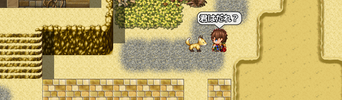

- **🚫このﾍﾟｰｼﾞではｲﾝｼﾞｹｰﾀを表示しない** 
  - このコマンドをイベントリストに入れておくと、そのページではｲﾝｼﾞｹｰﾀが表示されません。


## おまけ関数
  - イベントの条件分岐などで、「このイベントがプレイヤーの近くにいるか？」を確認できる関数が使えるようになります。

    ```javascript
    this.isNearPlayer(3)
    // 3は3マス以内かどうかを表します。この数字は変えられます。
    ```
    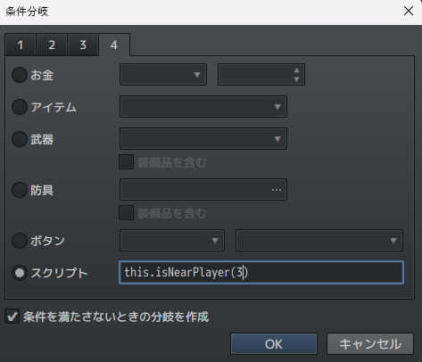

  この関数を活用すると、プレイヤーが近づいた時だけフキダシを出すような演出ができます。

  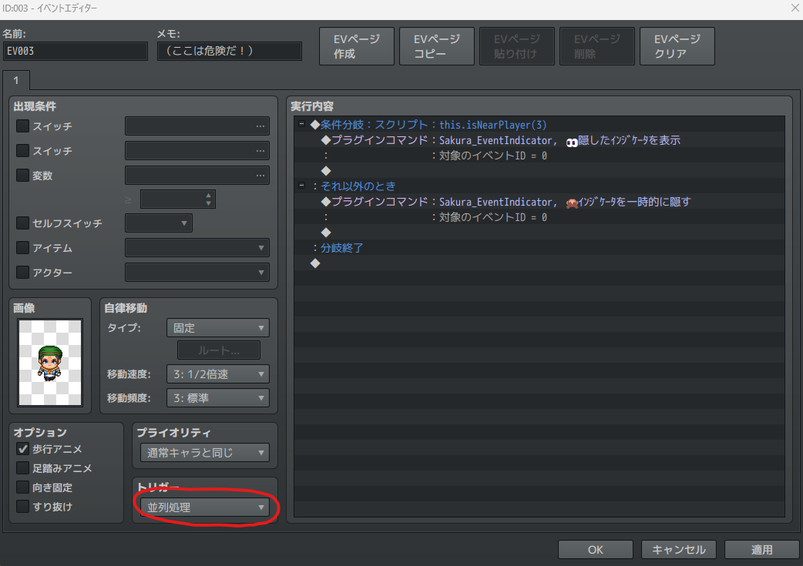

  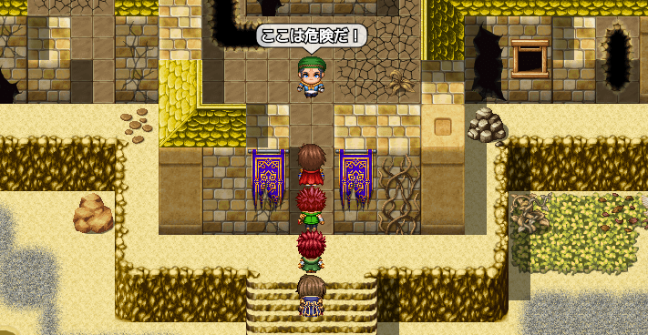

  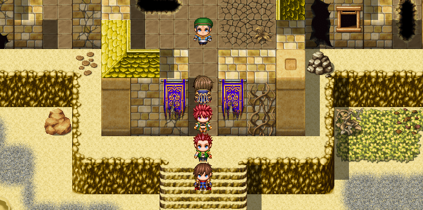

# License
- This software is released under the MIT license. http://opensource.org/licenses/mit-license.php
