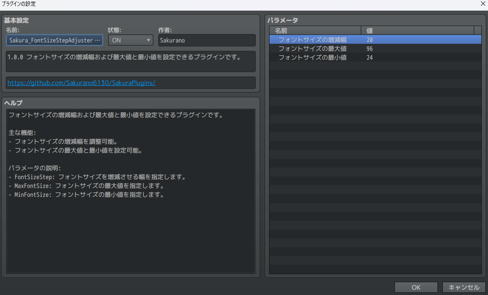
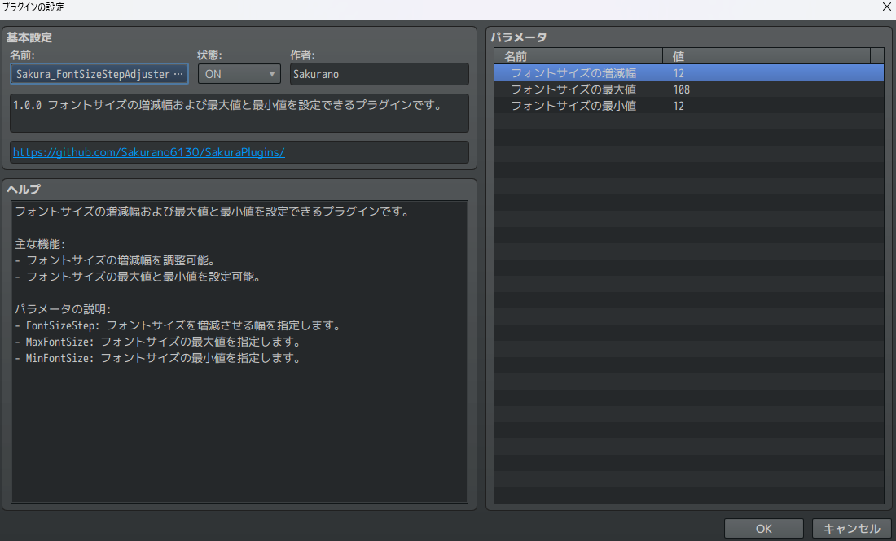

# Sakura_FontSizeStepAdjuster
メッセージウィンドウの制御文字`\}` `\{`で変化させるフォントサイズの増減幅を自由に設定できるプラグインです。

## ダウンロード
[Sakura_FontSizeStepAdjuster.js](https://raw.githubusercontent.com/Sakurano6130/SakuraPlugins/main/Sakura_FontSizeStepAdjuster/Sakura_FontSizeStepAdjuster.js)

## 更新履歴
| ver   | 日付       | 説明               |
| ----- | ---------- | ------------------ |
| 1.0.1 | 2024/08/31 | デフォルト値を修正 |
| 1.0.0 | 2024/08/30 | 公開               |

## 機能概要
- メッセージウィンドウの制御文字`\}` `\{`で変化させるフォントサイズの増減幅を自由に設定可能。

## プラグインパラメータ
- 変化させるフォントサイズの増減幅、最大値、最小値を指定してください。

## プラグインコマンドの使用
- プラグインコマンドはありません。

# License
- This software is released under the MIT license. http://opensource.org/licenses/mit-license.php
