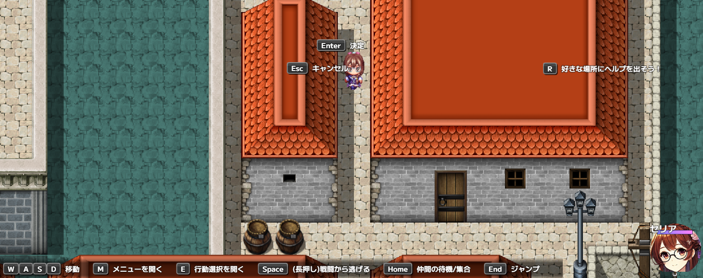
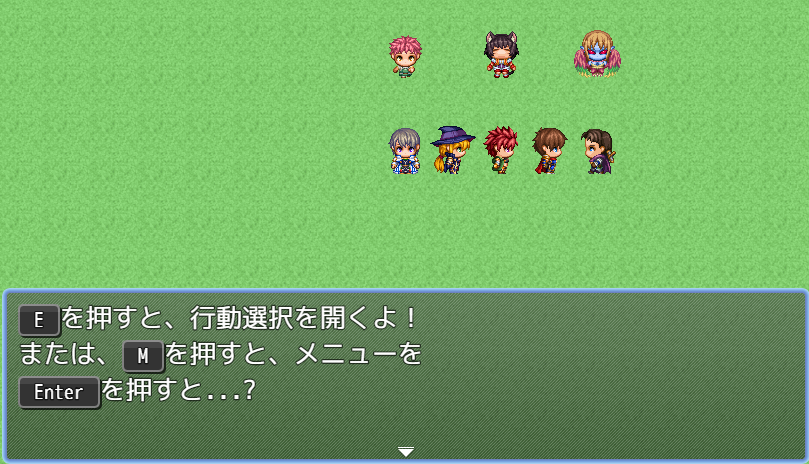

# Sakura_FreeKeyboardGuide
キーボードガイドを自由に出せるプラグイン

## ダウンロード
[Sakura_FreeKeyboardGuide.js](https://raw.githubusercontent.com/Sakurano6130/SakuraPlugins/main/Sakura_FreeKeyboardGuide/Sakura_FreeKeyboardGuide.js)

## 更新履歴
| ver   | 日付       | 説明     |
| ----- | ---------- | -------- |
| 0.5.0 | 2024/09/02 | ほぼ形に |
| 0.0.1 | 2024/08/31 | 作成開始 |

## 機能概要
- キーボードガイドウィンドウをシーンごとに複数好きな位置に表示
- ボタンの画像は不要。文字の長さで自動伸縮。
- スイッチで表示・非表示を切替
- ボタンをクリックするとそのキーボード押下をシミュレート
- メッセージウィンドウにも表示できる
  

### プラグインパラメータの説明:

- **SceneKeys**:  
  各シーンにおけるキーとその説明、クリックされたときに押すキーを定義します。設定されたスイッチによって表示内容が変わります。
  - Scene_Map, Scene_Item, Scene_Skill, Scene_Equip, Scene_Status, Scene_Battleを指定できます。

- **GlobalHideSwitch**:  
  このスイッチがONの時、キーボードガイドウィンドウを非表示にします。

- **FontSize**:  
  キーテキストに使用するフォントサイズです。

- **ButtonHeight**:  
  ボタンの高さを指定します。

- **ButtonPaddingX**:  
  ボタンのX軸内側余白を指定します。

- **ButtonPaddingY**:  
  ボタンのY軸内側余白を指定します。

- **ButtonMarginX**:  
  ボタンと説明の間の余白を指定します。

- **ButtonNameOffsetYInWindowMessage**:  
  ボタン内のテキストを描画する際のY軸オフセットです。正の値で下に、負の値で上に移動します。

- **ButtonOffsetYInWindowMessage**:  
  メッセージウィンドウ内でボタンを描画する際のY軸オフセットです。別プラグインでルビを振る際に高さを揃えるために調整してください。

### 利用方法:

- **キーボードガイドウィンドウの表示**:  
  `SceneKeys`でシーンごとの設定を行い、指定したスイッチをONにしてください。

- **メッセージウィンドウ内のボタン描画**:  
  メッセージウィンドウ内で `\BTN[ボタン名]` を使用すると、指定したボタンが描画されます。

# License
- This software is released under the MIT license. http://opensource.org/licenses/mit-license.php
