# Sakura_FreeKeyboardGuide
キーボードガイドを自由に出せるプラグイン

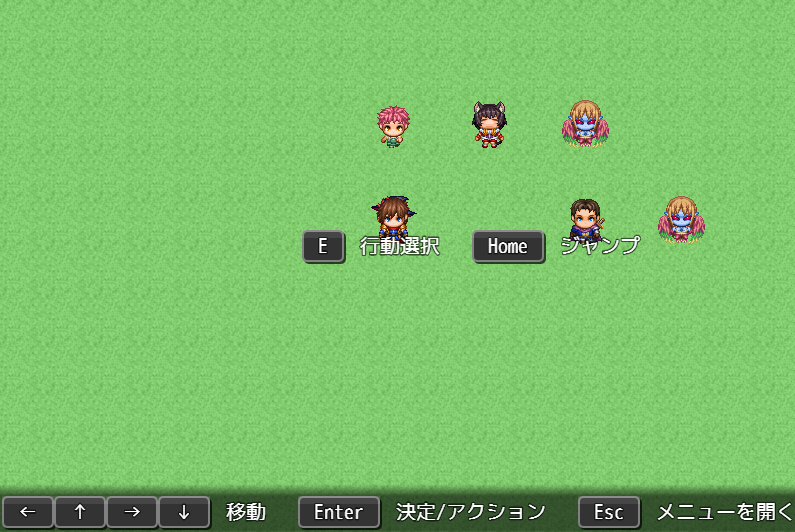

## ダウンロード
[Sakura_FreeKeyboardGuide.js](https://raw.githubusercontent.com/Sakurano6130/SakuraPlugins/main/Sakura_FreeKeyboardGuide/Sakura_FreeKeyboardGuide.js)

## 更新履歴
| ver   | 日付       | 説明                                                                                                                                                                              |
| ----- | ---------- | --------------------------------------------------------------------------------------------------------------------------------------------------------------------------------- |
| 2.1.1 | 2025/05/11 | マウスアイコンの表示座標計算不具合修正                                                                                                                                            |
| 2.1.0 | 2025/05/10 | クリックなし表示、マウスホイールのハイライト機能を追加                                                                                                                            |
| 2.0.0 | 2025/05/09 | マウスアイコンの表示ができるように                                                                                                                                                |
| 1.2.0 | 2024/10/03 | 表示するウィンドウの幅と高さを指定できるように                                                                                                                                    |
| 1.1.1 | 2024/09/19 | プラグインパラメータの説明文の誤り修正（処理の変更なし）                                                                                                                          |
| 1.1.0 | 2024/09/18 | 表示できるSceneを拡大 他のﾌﾟﾗｸﾞｲﾝの任意のSceneでもたぶん表示できるように（ただしそのﾌﾟﾗｸﾞｲﾝ次第なのでｴﾗｰになる可能性はあります） イベント実行中にも表示するか選択できる機能追加 |
| 1.0.2 | 2024/09/09 | ツクールのシステム設定で、画面の幅・高さとUIエリアの幅・高さが異なる設定をしている場合の位置を調整。                                                                              |
| 1.0.1 | 2024/09/02 | デフォルト値変更                                                                                                                                                                  |
| 1.0.0 | 2024/09/02 | 公開                                                                                                                                                                              |
| 0.5.0 | 2024/09/02 | ほぼ形に                                                                                                                                                                          |
| 0.0.1 | 2024/08/31 | 作成開始                                                                                                                                                                          |

## 機能概要
### キーボードガイドウィンドウをシーンごとに複数好きな位置に表示
### ボタンの画像は不要。文字の長さで自動伸縮。
### スイッチで表示・非表示を切替
### ボタンをクリックするとそのキーボード押下をシミュレート
### \BTN[ボタンの名前]で、メッセージウィンドウにも表示できる

---
### マウスアイコン表示を可能に `ver.2.0`
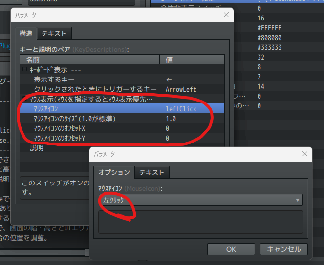

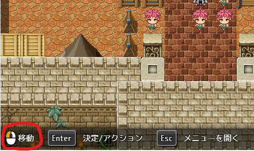

### クリックなし表示、マウスホイールのハイライト機能を追加 `ver.2.1`
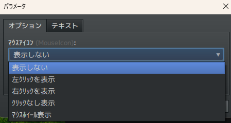

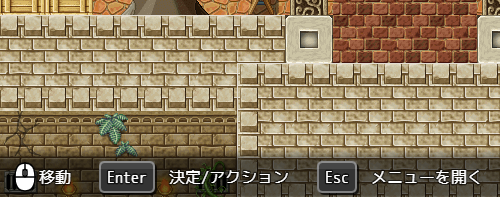

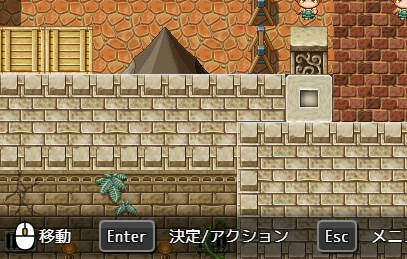

### 表示できるSceneを拡大 `ver.1.1`
- Scene_Map
- Scene_Menu
- Scene_Item
- Scene_Skill
- Scene_Equip
- Scene_Status
- Scene_Battle
- Scene_Shop `ver.1.1` ※下記、「イベント実行中にも表示」をオンにしないと表示されません
- Scene_Title `ver.1.1`
- Scene_Load `ver.1.1`
- Scene_Options `ver.1.1`
- Scene_Save `ver.1.1`
- Scene_GameEnd `ver.1.1`

  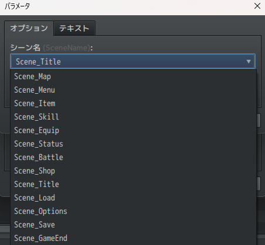

---

### 他のプラグインなどで作成される上記以外のSceneに表示したい場合も、 **たぶん** 対応。`ver.1.1`

選択肢にないSceneは、テキストから直接入力してください。

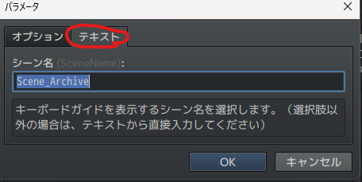

**注）ただし、そのプラグイン次第なところもあるので全てのプラグインに対応できる保証はありません！**

---

### デフォルトではイベント実行中に非表示になるようにしていますが、イベント実行中にも表示する機能を追加。`ver.1.1`

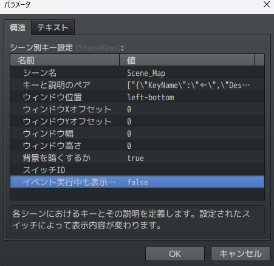

特にScene_Shopは多くの場合、イベントから呼び出すと思うのでこれを「オン」にしないと表示されません。

### 表示するウィンドウの幅と高さを指定できる機能を追加。`ver.1.2`

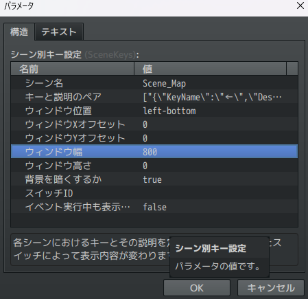

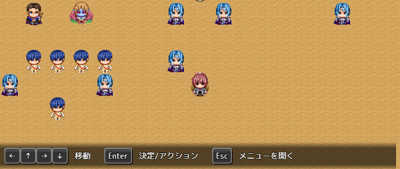

背景を横一杯に表示したかったり、他プラグインとの競合対策にご利用ください。

---

### プラグインパラメータの説明:

- **SceneKeys**:  
  各シーンにおけるキーとその説明、クリックされたときに押すキーを定義します。設定されたスイッチによって表示内容が変わります。
  - 同じシーンを複数登録すると複数表示されます。
  
    

  - 表示位置や、表示/非表示を切り替えるスイッチを設定します。（スイッチの指定がない時は常に表示です）

    

  - ボタンの設定をします。

    
  
  - 表示するキー、説明、クリックされたときにトリガーするボタンを決めます。（クリックされたときにトリガーするボタンは不要の場合指定しなくても良いです）
  - `ver.2.0` から、マウスアイコンの表示ができるようになりました。マウスアイコンの表示設定をすると、マウスアイコンの表示が優先されます。

    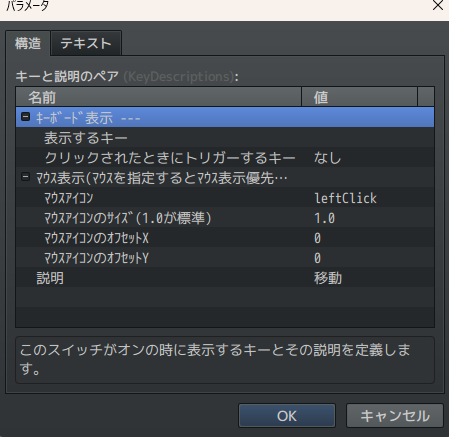

- **GlobalHideSwitch**:  
  このスイッチがONの時、全てのキーボードガイドウィンドウを非表示にします。

- **FontSize**:  
  ボタンの文字のフォントサイズです。

- **ButtonTextColor**:  
  ボタンの文字の色です。

- **ButtonEdgeColor**:  
  ボタンの外枠の色です。

- **ButtonInnerColor**:  
  ボタンの内側の色です。

- **ButtonTextColor**:  
  ボタンのX軸内側余白を指定します。

- **ButtonPaddingY**:  
  ボタンのY軸内側余白を指定します。

- **ButtonMarginX**:  
  ボタンと説明の間の余白を指定します。

- **ButtonNameOffsetYInWindowMessage**:  
  ボタン内のテキストを描画する際のY軸オフセットです。フォントによってうまくボタンの真ん中に来ないときに調整してください。

- **ButtonOffsetYInWindowMessage**:  
  メッセージウィンドウ内でボタンを描画する際のY軸オフセットです。別プラグインでルビを振る際に高さを揃えるために調整してください。

### メッセージウィンドウ内のボタン描画
  メッセージウィンドウ内で `\BTN[ボタン名]` を使用すると、指定したボタンが描画されます。

  

### ウィンドウの重なりについて
  - RPGツクールのウィンドウ描画の仕様で、ウィンドウを重ねて表示した場合、後ろのウィンドウが欠けて表示されたように見えてしまいます。
  - これが気になる方は、[Sakura_NonBlockingWindowLayer](../Sakura_NonBlockingWindowLayer/Sakura_NonBlockingWindowLayer.md)をお試しください。

  

# License
- This software is released under the MIT license. http://opensource.org/licenses/mit-license.php

