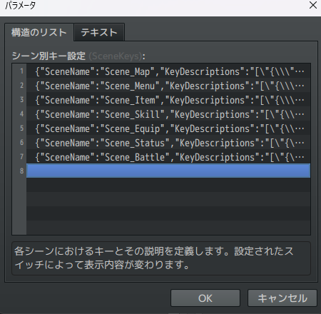
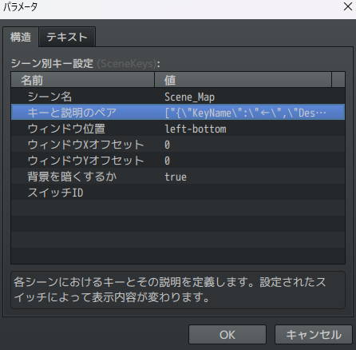
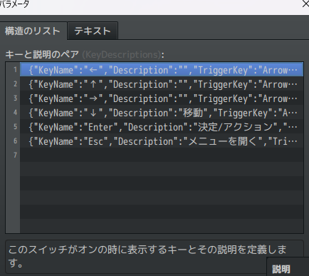
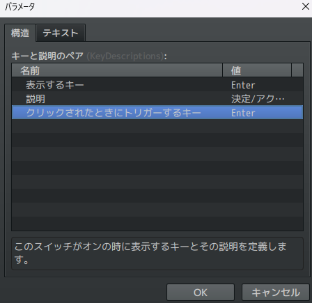
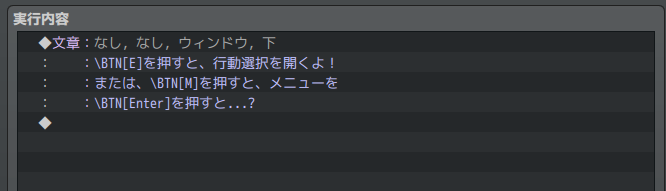
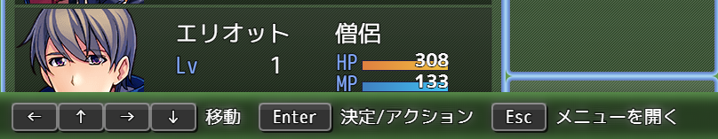

# Sakura_FreeKeyboardGuide
キーボードガイドを自由に出せるプラグイン

## ダウンロード
[Sakura_FreeKeyboardGuide.js](Sakura_FreeKeyboardGuide.js)

## 更新履歴
| ver   | 日付       | 説明     |
| ----- | ---------- | -------- |
| 0.5.0 | 2024/09/02 | ほぼ形に |
| 0.0.1 | 2024/08/31 | 作成開始 |

## 機能概要
- キーボードガイドウィンドウをシーンごとに複数好きな位置に表示
- ボタンの画像は不要。文字の長さで自動伸縮。
- スイッチで表示・非表示を切替
- ボタンをクリックするとそのキーボード押下をシミュレート
- メッセージウィンドウにも表示できる
  

### プラグインパラメータの説明:

- **SceneKeys**:  
  各シーンにおけるキーとその説明、クリックされたときに押すキーを定義します。設定されたスイッチによって表示内容が変わります。
  - Scene_Map, Scene_Menu, Scene_Item, Scene_Skill, Scene_Equip, Scene_Status, Scene_Battleを指定できます。
  - 同じシーンを複数登録すると複数表示されます。
  
    

  - 表示位置や、表示/非表示を切り替えるスイッチを設定します。（スイッチの指定がない時は常に表示です）

    

  - ボタンの設定をします。

    
  
  - 表示するキー、説明、クリックされたときにトリガーするボタンを決めます。（クリックされたときにトリガーするボタンは不要の場合指定しなくても良いです）

    

- **GlobalHideSwitch**:  
  このスイッチがONの時、全てのキーボードガイドウィンドウを非表示にします。

- **FontSize**:  
  ボタンの文字のフォントサイズです。

- **ButtonTextColor**:  
  ボタンの文字の色です。

- **ButtonEdgeColor**:  
  ボタンの外枠の色です。

- **ButtonInnerColor**:  
  ボタンの内側の色です。

- **ButtonTextColor**:  
  ボタンのX軸内側余白を指定します。

- **ButtonPaddingY**:  
  ボタンのY軸内側余白を指定します。

- **ButtonMarginX**:  
  ボタンと説明の間の余白を指定します。

- **ButtonNameOffsetYInWindowMessage**:  
  ボタン内のテキストを描画する際のY軸オフセットです。正の値で下に、負の値で上に移動します。

- **ButtonOffsetYInWindowMessage**:  
  メッセージウィンドウ内でボタンを描画する際のY軸オフセットです。別プラグインでルビを振る際に高さを揃えるために調整してください。

### メッセージウィンドウ内のボタン描画
  メッセージウィンドウ内で `\BTN[ボタン名]` を使用すると、指定したボタンが描画されます。

  

### ウィンドウの重なりについて
  - RPGツクールのウィンドウ描画の仕様で、ウィンドウを重ねて表示した場合、後ろのウィンドウが欠けて表示されたように見えてしまいます。
  - これが気になる方は、[Sakura_NonBlockingWindowLayer](../Sakura_NonBlockingWindowLayer/Sakura_NonBlockingWindowLayer.md)をお試しください。

  

# License
- This software is released under the MIT license. http://opensource.org/licenses/mit-license.php
