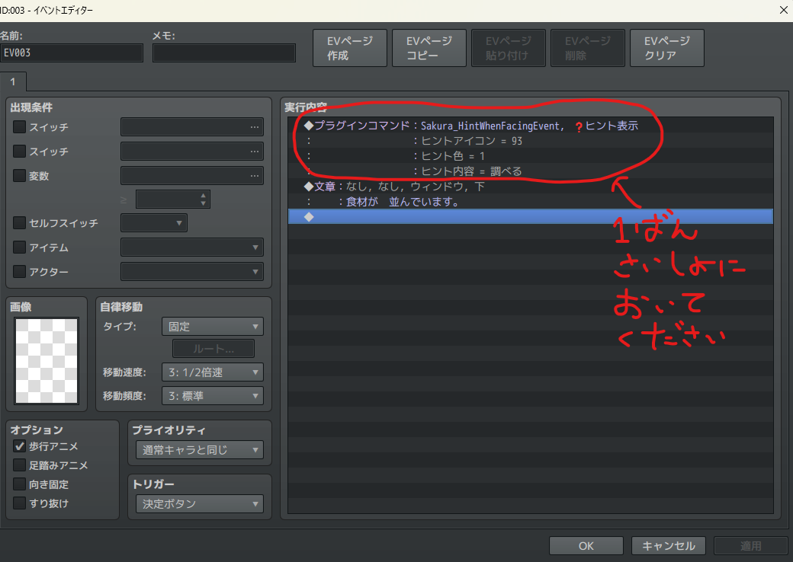
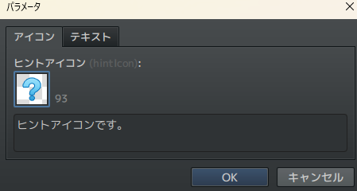
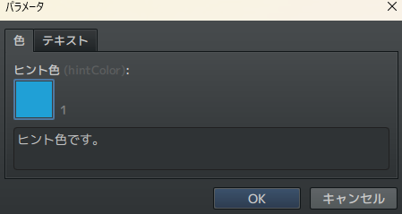
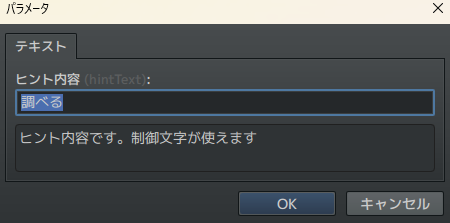

# Sakura_HintWhenFacingEvent
❓ ヒント表示プラグイン

## ダウンロード
[Sakura_HintWhenFacingEvent.js](https://raw.githubusercontent.com/Sakurano6130/SakuraPlugins/main/Sakura_HintWhenFacingEvent/Sakura_HintWhenFacingEvent.js)

## 更新履歴
| ver   | 日付       | 説明                                                                                                                                                         |
| ----- | ---------- | ------------------------------------------------------------------------------------------------------------------------------------------------------------ |
| 1.0.1 | 2024/11/19 | キャラクターの画像ファイル名に「!」がついているとき、上からの接触時にうまく表示されてなかったため修正 トリアコンタン様HalfMove.jsの半歩移動判定条件を修正 |
| 1.0.0 | 2024/11/17 | 公開                                                                                                                                                         |

## 機能説明
### イベント接触時にプレイヤーにヒントを表示します

### プラグインパラメータ

- **defaultFontSize**
  - ﾋﾝﾄのﾌｫﾝﾄｻｲｽﾞです。

- **offsetX**
  - ﾋﾝﾄ表示のX軸位置調整です。

- **offsetY**
  - ﾋﾝﾄ表示のY軸位置調整です。

### ヒント表示のさせ方

表示させたいイベントの実行内容の一番最初にプラグインコマンドを置いてください。

- ヒントアイコン

  アイコンを選択してください。

  

- ヒント色

  ヒントの文字の色を選択してください。

  

- ヒントテキスト

  ヒント表示する文字を指定してください。（制御文字が使えます）

  

### 他プラグイン対策について

以下のプラグインでも正しく動作するように対応したつもりです。（漏れはあるかもしれません。その場合は対応します）

- トリアコンタン様 HalfMove.js対応（v2.2.1）
  - [https://github.com/triacontane/RPGMakerMV/tree/mz_master/HalfMove.js](https://github.com/triacontane/RPGMakerMV/tree/mz_master/HalfMove.js)

- うなぎおおとろ様 DotMoveSystem.js対応（v2.2.4）
  - [https://raw.githubusercontent.com/unagiootoro/RPGMZ/master/DotMoveSystem.js](https://raw.githubusercontent.com/unagiootoro/RPGMZ/master/DotMoveSystem.js)

### このページで使用しているアイコンについて

yanfly様のアイコンを使用しています。

[http://yanfly.moe/2015/10/23/freebies-mv-ready-ace-icons/](http://yanfly.moe/2015/10/23/freebies-mv-ready-ace-icons/)

# License
- This software is released under the MIT license. http://opensource.org/licenses/mit-license.php
