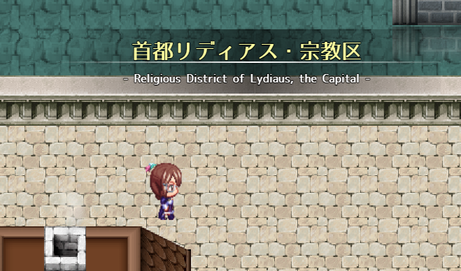
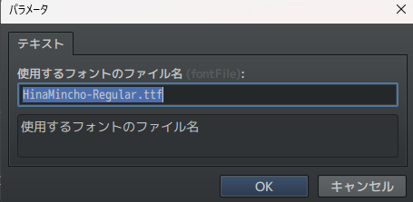
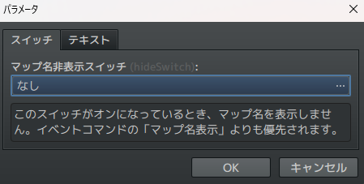
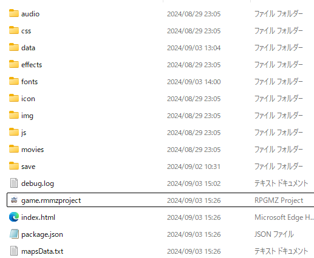
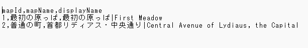

# Sakura_MapNameExtend
マップ名表示をちょっといいかんじにします✨。

  

## ダウンロード
[Sakura_MapNameExtend.js](https://raw.githubusercontent.com/Sakurano6130/SakuraPlugins/main/Sakura_MapNameExtend/Sakura_MapNameExtend.js)

## 更新履歴
| ver   | 日付       | 説明                                                                                                                          |
| ----- | ---------- | ----------------------------------------------------------------------------------------------------------------------------- |
| 1.0.5 | 2024/09/25 | マップ名非表示スイッチとイベントコマンドの「マップ名表示」をOFFにしたときの動きが同じになるように。ただしスイッチの設定が優先 |
| 1.0.4 | 2024/09/23 | マップ名非表示スイッチを追加                                                                                                  |
| 1.0.3 | 2024/09/09 | ツクールのシステム設定で、画面の幅・高さとUIエリアの幅・高さが異なる設定をしている場合の位置を調整。                          |
| 1.0.2 | 2024/09/07 | メニューなどから戻ってきた場合に再表示されていたため修正                                                                      |
| 1.0.1 | 2024/09/04 | 1行しかなかった場合の表示を若干修正                                                                                           |
| 1.0.0 | 2024/09/03 | 公開                                                                                                                          |

## 機能概要
- マップ名表示を拡張
- フォント、サイズを指定可能
- マップ設定の表示名を|（半角）で区切ると、メイン行とサブ行の2行に分けて表示
- マップ名表示を行うかどうかをスイッチで制御できる `ver.1.0.5`

## フォントファイルの配置
  （このステップは、独自のフォントを使用しない場合は不要です）
- プロジェクトフォルダ直下の/fontsフォルダの中に、拡張子「.ttf」ファイルを配置してください。
- プラグインパラメータの使用するフォントのファイル名で拡張子「.ttf」まで含めたファイル名を指定して下さい。
  
  

## プラグインパラメータ
- **mapNamePosition**
  - マップ表示を表示する位置（中央、左上、右上、左下、右下から選択）
- **mapNameTextX**
  - マップ表示の表示位置（X座標）
- **mapNameTextY**
  - マップ表示の表示位置（Y座標）
- **fontFile**
  - 使用するフォントのファイル名
- **mainFontSize**
  - メインのフォントサイズ
- **mainFontColor**
  - メインのフォント色
- **subFontSize**
  - サブのフォントサイズ
- **subFontColor**
  - サブのフォント色
- **hideSwitch**
  - マップ名非表示スイッチ `ver.1.0.5`

    このスイッチがオンになっているとき、マップ名を表示しません。イベントコマンドの「マップ名表示」よりも優先されます。

    

    
- **needsOutputMaps**
  - マップ表示名一覧をファイルに書き込むかどうか。これをtrueにして、テストプレイを実行するとプロジェクトフォルダ直下に「mapsData.txt」というファイルが出力されます。
  - マップ表示名を一覧で確認する方法がなかったため、付けた機能です。
  
    

    

# License
- This software is released under the MIT license. http://opensource.org/licenses/mit-license.php
