# Sakura_MapStatusHud
マップ上にステータス表示します。

  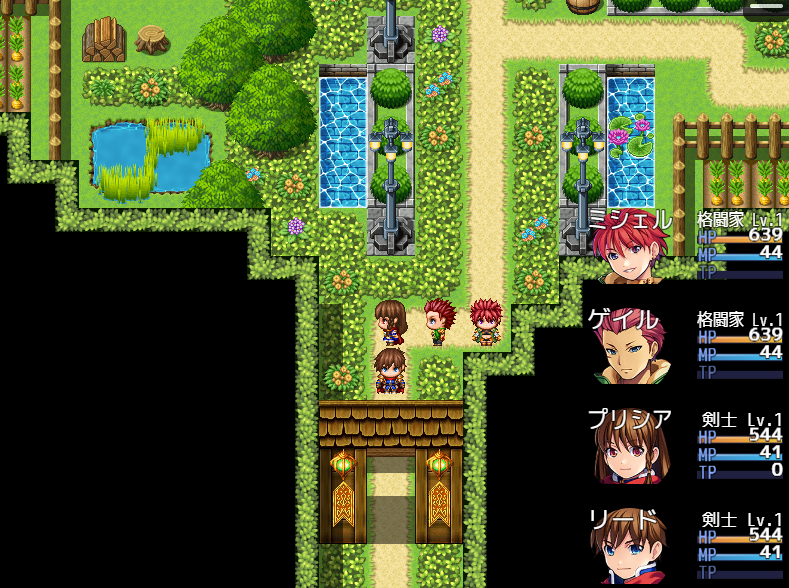

## ダウンロード
[Sakura_MapStatusHud.js](https://raw.githubusercontent.com/Sakurano6130/SakuraPlugins/main/Sakura_MapStatusHud/Sakura_MapStatusHud.js)

## 更新履歴
| ver   | 日付       | 説明                                                                                                                                                                                                                           |
| ----- | ---------- | ------------------------------------------------------------------------------------------------------------------------------------------------------------------------------------------------------------------------------ |
| 1.3.1 | 2024/10/04 | 経験値の始点と終点の色表示が逆になっていたので修正                                                                                                                                                                             |
| 1.3.0 | 2024/09/30 | 経験値の表示を追加 各ゲージ、ラベルの色をプラグインパラメータで変えられる機能を追加 HP,MP,TP,経験値に変化があった場合に差分をポップアップ表示する機能を追加 各アクターのウィンドウの高さのデフォルト値を100→110に変更 |
| 1.2.0 | 2024/09/08 | 画面の幅・高さとUIエリアの幅・高さが異なる場合の位置調整。 表示位置の調整機能追加。 常に半分表示機能の追加。                                                                                                             |
| 1.1.0 | 2024/09/07 | 表示制御の機能追加、アクター表示順の選択機能追加                                                                                                                                                                               |
| 1.0.0 | 2024/09/05 | 公開                                                                                                                                                                                                                           |

## 機能概要
- マップ上にステータス表示
- プラグインパラメータで各種設定が可能

  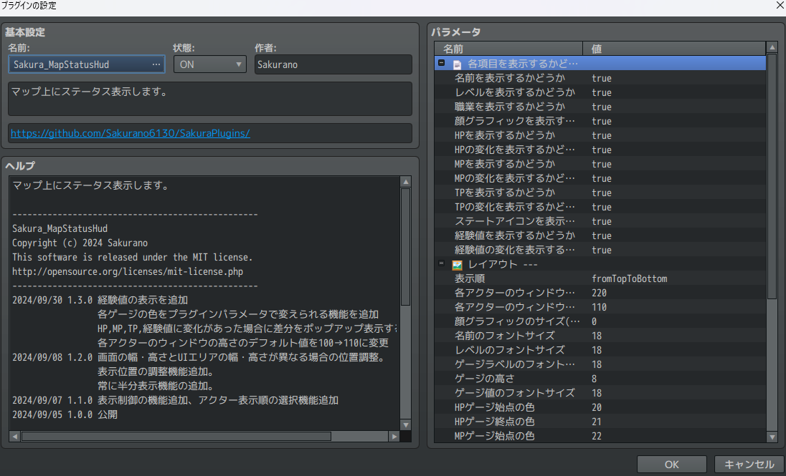

- 時間差で自動的に半分隠れる
  
  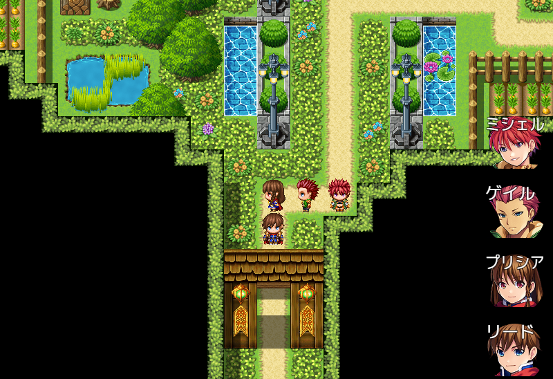

- プレイヤーと重なったとき半透明になる

  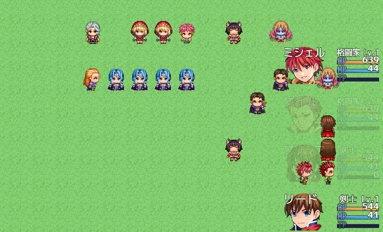

- プラグインコマンドで常に表示、隠すを切り替えられる `ver1.1` 
- 常に半分隠すこともできる `ver1.2`
  
  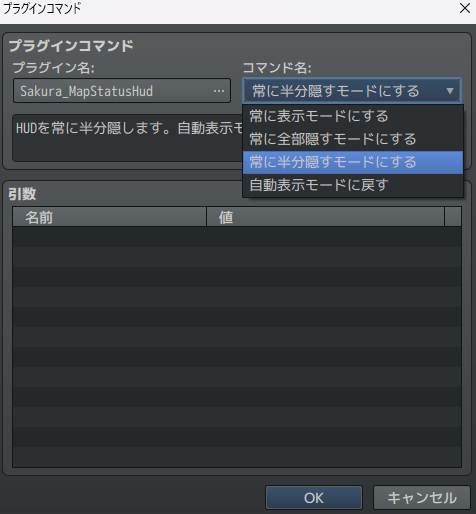

- アクターの表示順を上から下か下から上から選択できる `ver1.1` 
  
  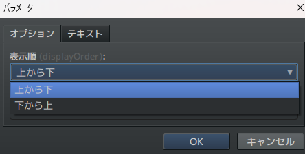

- 全体の位置を調整できる `ver1.2` 
  
  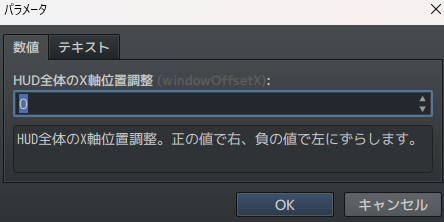

  

- 顔グラフィックの周りに円形ゲージで経験値を表示できる `ver1.3` 
  
  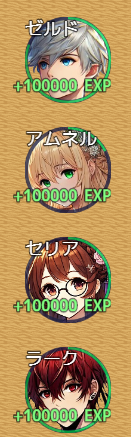

- 各ゲージ、ラベルの色をプラグインパラメータで変更できる `ver1.3`

  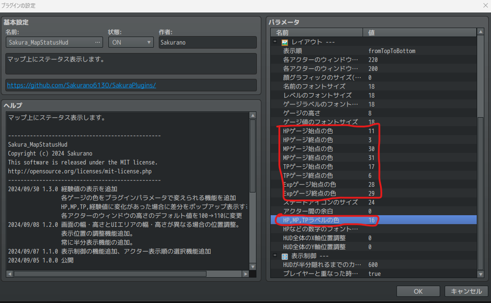

  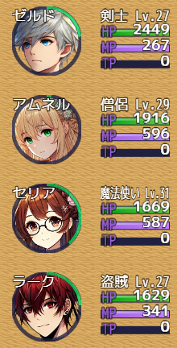

- HP,MP,TP,経験値に変化があった場合、差分をポップアップ表示することができる `ver1.3`

  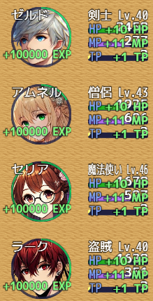

- 数字が変化する際に、数字が徐々に変化するアニメーションするように `ver1.3`

- 各アクターのウィンドウの高さを顔グラフィックより高くとっていた場合の、ステートアイコンの表示位置を調整 `ver1.3`
  
  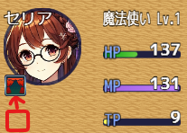

## フォントファイルの配置
  （このステップは、独自のフォントを使用しない場合は不要です）
- プロジェクトフォルダ直下の/fontsフォルダの中に、拡張子「.ttf」ファイルを配置してください。
- プラグインパラメータの使用するフォントのファイル名で拡張子「.ttf」まで含めたファイル名を指定して下さい。
  
## プラグインパラメータの説明
### 📄 各項目を表示するかどうか
- **ShowActorName**
  - アクター名を表示するかどうか（`true` で表示、`false` で非表示）

- **ShowActorLevel**
  - アクターレベルを表示するかどうか（`true` で表示、`false` で非表示）

- **ShowActorClass**
  - アクター職業を表示するかどうか（`true` で表示、`false` で非表示）

- **ShowActorFace**
  - アクターの顔グラフィックを表示するかどうか（`true` で表示、`false` で非表示）

- **ShowActorHP**
  - アクターのHPを表示するかどうか（`true` で表示、`false` で非表示）

- **ShowActorHPDiff** `ver1.3`
  - HPの変化を表示するかどうか`true` で表示、`false` で非表示）

- **ShowActorMP**
  - アクターのMPを表示するかどうか（`true` で表示、`false` で非表示）

- **ShowActorMPDiff** `ver1.3`
  - MPの変化を表示するかどうか`true` で表示、`false` で非表示）

- **ShowActorTP**
  - アクターのTPを表示するかどうか（`true` で表示、`false` で非表示）

- **ShowActorTPDiff** `ver1.3`
  - TPの変化を表示するかどうか`true` で表示、`false` で非表示）

- **ShowActorState**
  - アクターのステートアイコンを表示するかどうか（`true` で表示、`false` で非表示）

- **ShowActorExp**
  - アクターの経験値を表示するかどうか（`true` で表示、`false` で非表示）

- **ShowActorExpDiff** `ver1.3`
  - 経験値の変化を表示するかどうか`true` で表示、`false` で非表示）

### 🖼️ レイアウト
- **displayOrder** `ver1.1`
  - 各アクターの表示順を設定します。

- **windowWidth**
  - ウィンドウの幅を設定します。

- **windowHeight**
  - ウィンドウの高さを設定します。（全体の高さではなく各アクターの高さです）

- **faceSize**
  - 顔グラフィックのサイズを設定します。等倍は144です。`0` にすると大きさを自動調整します。

- **nameFontSize**
  - アクター名のフォントサイズを設定します。

- **levelFontSize**
  - レベルのフォントサイズを設定します。

- **gaugeLabelFontSize**
  - ゲージラベルのフォントサイズを設定します。

- **gaugeHeight**
  - ゲージの高さを設定します。

- **gaugeValueFontSize**
  - ゲージ値のフォントサイズを設定します。

- **gaugeColorHp1** `ver1.3`
  - HPゲージ始点の色を設定します。

- **gaugeColorHp2** `ver1.3`
  - HPゲージ終点の色を設定します。

- **gaugeColorMp1** `ver1.3`
  - MPゲージ始点の色を設定します。

- **gaugeColorMp2** `ver1.3`
  - MPゲージ終点の色を設定します。

- **gaugeColorTp1** `ver1.3`
  - TPゲージ始点の色を設定します。

- **gaugeColorTp2** `ver1.3`
  - TPゲージ終点の色を設定します。

- **gaugeColorExp1** `ver1.3`
  - Expゲージ始点の色を設定します。

- **gaugeColorExp2** `ver1.3`
  - Expゲージ終点の色を設定します。

- **statusIconSize**
  - ステートアイコンのサイズを設定します。

- **marginOfEachActor**
  - アクター間の余白を設定します。

- **labelColor** `ver1.3`
  - HP,MP,TPラベルの色を設定します。

- **fontFileForString**
  - 文字やラベルのフォントファイル名。

- **fontFileForNumber**
  - HPなどの数字のフォントファイル名。

- **windowOffsetX** `ver1.2`
  - HUD全体のX軸位置調整。正の値で右、負の値で左にずらします。

- **windowOffsetY** `ver1.2`
  - HUD全体のY軸位置調整。正の値で下、負の値で上にずらします。

### 🎛️ 表示制御
- **hudHideCount**
  - HUDが自動で隠れるまでのカウント数を設定します。

- **needsCheckPlayerCollide**
  - プレイヤーと重なった時、HUDを半透明にするか設定します。処理が重たくなった場合は `false` にしてください。

- ~~**globalHideSwitch**~~
  - ~~このスイッチがONの時、HUDを非表示にします。~~
  
  この機能は`ver1.1`で廃止しました。以下のプラグインコマンドで制御してください。

## プラグインコマンドの説明
- **常に表示モードにする** `ver1.1`
  - HUDを常に表示します。自動表示モードに戻すまで表示し続けます。イベント実行中も表示されます。

- **常に全部隠すモードにする** `ver1.1`
  - HUDを常に全部隠します。自動表示モードに戻すまで表示されません。

- **常に半分隠すモードにする** `ver1.2`
  - HUDを常に半分隠します。自動表示モードに戻すまで半分隠れます

- **自動表示モードに戻す** `ver1.1`
  - 自動表示モードに切り替えます。時間差で半分隠れるようになり、イベント実行中は全体が隠れます。

## ウィンドウの重なりについて
  - RPGツクールのウィンドウ描画の仕様で、ウィンドウを重ねて表示した場合、後ろのウィンドウが欠けて表示されたように見えてしまいます。
  - これが気になる方は、[Sakura_NonBlockingWindowLayer](../Sakura_NonBlockingWindowLayer/Sakura_NonBlockingWindowLayer.md)をお試しください。

# License
- This software is released under the MIT license. http://opensource.org/licenses/mit-license.php
