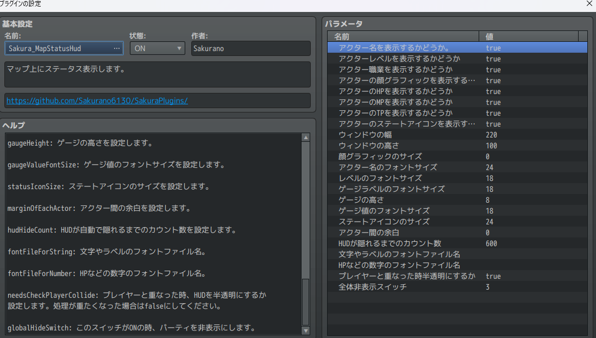

# Sakura_MapStatusHud
マップ上にステータス表示します。

  

## ダウンロード
[Sakura_MapStatusHud.js](https://raw.githubusercontent.com/Sakurano6130/SakuraPlugins/main/Sakura_MapStatusHud/Sakura_MapStatusHud.js)

## 更新履歴
| ver   | 日付       | 説明 |
| ----- | ---------- | ---- |
| 1.0.0 | 2024/09/05 | 公開 |

## 機能概要
- マップ上にステータス表示
- プラグインパラメータで各種設定が可能

  

- 時間差で自動的に半分隠れる
  
  

- プレイヤーと重なったとき半透明になる

  

## フォントファイルの配置
  （このステップは、独自のフォントを使用しない場合は不要です）
- プロジェクトフォルダ直下の/fontsフォルダの中に、拡張子「.ttf」ファイルを配置してください。
- プラグインパラメータの使用するフォントのファイル名で拡張子「.ttf」まで含めたファイル名を指定して下さい。
  
## プラグインパラメータの説明
- **ShowActorName**
  - アクター名を表示するかどうか（`true` で表示、`false` で非表示）

- **ShowActorLevel**
  - アクターレベルを表示するかどうか（`true` で表示、`false` で非表示）

- **ShowActorClass**
  - アクター職業を表示するかどうか（`true` で表示、`false` で非表示）

- **ShowActorFace**
  - アクターの顔グラフィックを表示するかどうか（`true` で表示、`false` で非表示）

- **ShowActorHP**
  - アクターのHPを表示するかどうか（`true` で表示、`false` で非表示）

- **ShowActorMP**
  - アクターのMPを表示するかどうか（`true` で表示、`false` で非表示）

- **ShowActorTP**
  - アクターのTPを表示するかどうか（`true` で表示、`false` で非表示）

- **ShowActorState**
  - アクターのステートアイコンを表示するかどうか（`true` で表示、`false` で非表示）

- **windowWidth**
  - ウィンドウの幅を設定します。

- **windowHeight**
  - ウィンドウの高さを設定します。

- **faceSize**
  - 顔グラフィックのサイズを設定します。等倍は144です。`0` にすると大きさを自動調整します。

- **nameFontSize**
  - アクター名のフォントサイズを設定します。

- **levelFontSize**
  - レベルのフォントサイズを設定します。

- **gaugeLabelFontSize**
  - ゲージラベルのフォントサイズを設定します。

- **gaugeHeight**
  - ゲージの高さを設定します。

- **gaugeValueFontSize**
  - ゲージ値のフォントサイズを設定します。

- **statusIconSize**
  - ステートアイコンのサイズを設定します。

- **marginOfEachActor**
  - アクター間の余白を設定します。

- **hudHideCount**
  - HUDが自動で隠れるまでのカウント数を設定します。

- **fontFileForString**
  - 文字やラベルのフォントファイル名。

- **fontFileForNumber**
  - HPなどの数字のフォントファイル名。

- **needsCheckPlayerCollide**
  - プレイヤーと重なった時、HUDを半透明にするか設定します。処理が重たくなった場合は `false` にしてください。

- **globalHideSwitch**
  - このスイッチがONの時、HUDを非表示にします。

## ウィンドウの重なりについて
  - RPGツクールのウィンドウ描画の仕様で、ウィンドウを重ねて表示した場合、後ろのウィンドウが欠けて表示されたように見えてしまいます。
  - これが気になる方は、[Sakura_NonBlockingWindowLayer](../Sakura_NonBlockingWindowLayer/Sakura_NonBlockingWindowLayer.md)をお試しください。

# License
- This software is released under the MIT license. http://opensource.org/licenses/mit-license.php
