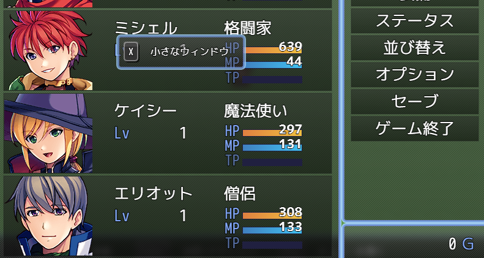

# Sakura_NonBlockingWindowLayer
ウィンドウが重なったとき、後ろのウィンドウを隠さないプラグイン

## 適用前

## 適用後

## ダウンロード
[Sakura_NonBlockingWindowLayer.js](Sakura_NonBlockingWindowLayer.js)

## 更新履歴
| ver   | 日付       | 説明               |
| ----- | ---------- | ------------------ |
| 1.0.0 | 2024/09/02 | 公開               |

## 機能概要
- ウィンドウが重なった時、後ろのウィンドウが隠れないようにします。

## RPGツクールMZのデフォルト仕様
- 通常のRPGツクールMZでは、ウィンドウが重なった場合、前面のウィンドウが後ろのウィンドウを完全に隠してしまいます。

## このプラグインの変更点
このプラグインを適用すると、ウィンドウが重なっても、後ろのウィンドウが見えたままになります。これにより、独自レイアウトのメニューなどを作る際に、レイアウトの自由度が上がります。

## プラグインパラメータ
- このプラグインには、特定の設定を行うプラグインパラメータはありません。

## プラグインコマンドの使用
- プラグインコマンドも必要ありませんので、インストールするだけで利用できます。

# License
- このソフトウェアは、MITライセンスのもとで公開されています。http://opensource.org/licenses/mit-license.php
