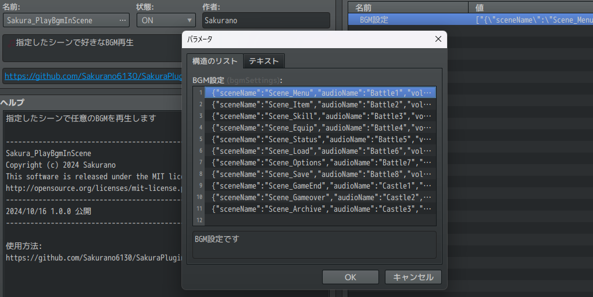
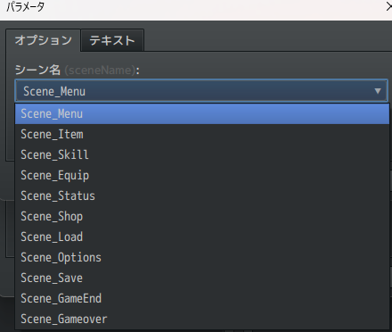
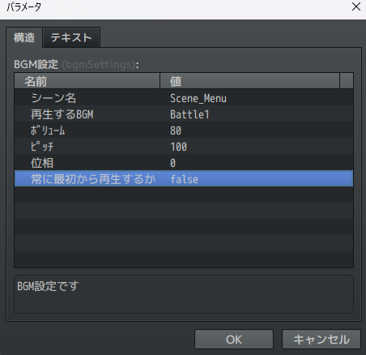

# Sakura_PlayBgmInScene
🎵指定したシーンで好きなBGM再生

## ダウンロード
[Sakura_PlayBgmInScene.js](https://raw.githubusercontent.com/Sakurano6130/SakuraPlugins/main/Sakura_PlayBgmInScene/Sakura_PlayBgmInScene.js)

## 更新履歴
| ver   | 日付       | 説明                                                                |
| ----- | ---------- | ------------------------------------------------------------------- |
| 1.0.1 | 2024/10/20 | メニューなどからマップに戻った時にBGMの途中から再生されるように修正 |
| 1.0.0 | 2024/10/16 | 公開                                                                |

## 機能説明
### 🎵指定したシーンで好きなBGMを再生します。

- シーンは以下を指定できます。
  - Scene_Menu
  - Scene_Item
  - Scene_Skill
  - Scene_Equip
  - Scene_Status
  - Scene_Shop
  - Scene_Load
  - Scene_Options
  - Scene_Save
  - Scene_GameEnd
  - Scene_Gameover

  外部プラグインなどで上記以外のシーンを指定したい場合は、テキスト入力から直接入力してください。

  注）Scene_Map,Scene_Title,Scene_Battleはデフォルト機能で設定できますので、このプラグインでは無視されます。

### 「常に最初から再生するか」の項目について

- これをオンにすると、曲の途中からではなく常に最初から再生するようになります。

# License
- This software is released under the MIT license. http://opensource.org/licenses/mit-license.php
