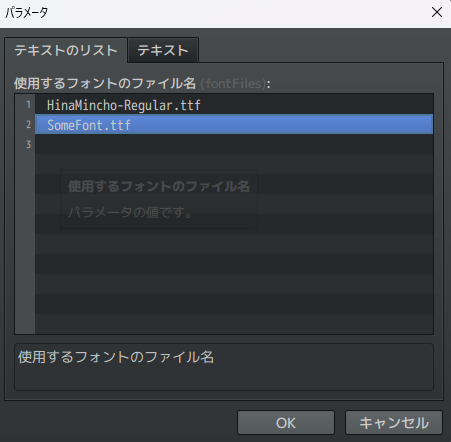
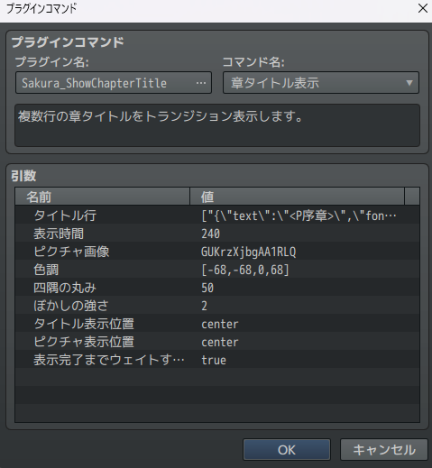
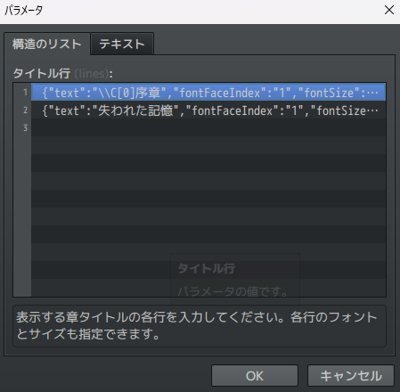
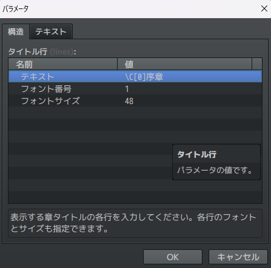
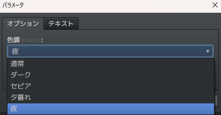
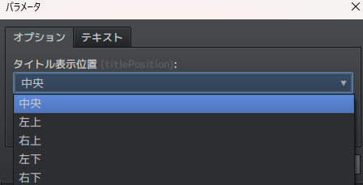
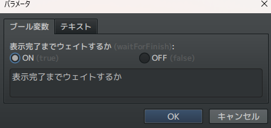
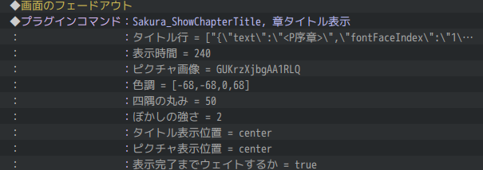

# Sakura_ShowChapterTitle
章タイトルをコマンド１つで表示し、フォントや背景を自由にカスタマイズできるプラグインです。

## ダウンロード
[Sakura_ShowChapterTitle.js](https://raw.githubusercontent.com/Sakurano6130/SakuraPlugins/main/Sakura_ShowChapterTitle/Sakura_ShowChapterTitle.js)

## 機能概要
- 複数行の章タイトルをフェードイン・アウト効果付きで表示
- 各行ごとにフォント、サイズを指定可能
- 背景にピクチャ画像を使用し、色調やぼかし効果の調整が可能
- タイトルとピクチャの表示位置を自由にカスタマイズ
- 表示完了までのウェイト機能を提供

## フォントファイルの配置 ※独自のフォントを使用しない場合は不要
- プロジェクトフォルダ直下の/fontsフォルダの中に、拡張子「.ttf」ファイルを配置してください。

## フォントの設定 ※独自のフォントを使用しない場合は不要
- プラグインパラメータ画面で、先ほど配置したフォントのファイル名（拡張子「.ttf」まで含む） を指定してください。
- フォントファイルは複数指定できます。指定した順に**番号**が割り当てられます。この**番号**を次のステップで使用します。

  

## プラグインコマンドの使用
- イベント内でプラグインコマンド「章タイトル表示」を使用してください。
- タイトル、フォント、サイズ、表示時間、ピクチャ画像などの設定を行ってください。

  

- タイトルは複数行書けます。制御文字を使えます。

  

- １行ごとにプラグインパラメータ画面で指定したフォント番号とフォントサイズを指定できます。

  

- 背景ピクチャの色調を以下から選択できます。

  

- タイトルの表示位置、ピクチャの表示位置を以下から選択できます。

  

- 表示完了までウェイトするかしないかを選択できます。

  

- 画面を黒画面にするかどうかまでは、本プラグインでは制御しません。黒画面にしたい場合は事前に「画面のフェードアウト」をしておいてください。

  

# License
- This software is released under the MIT license. http://opensource.org/licenses/mit-license.php
