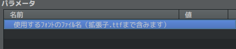

# Sakura_ShowComboDamage
✨ コンボダメージ表示プラグイン

## ダウンロード
[Sakura_ShowComboDamage.js](https://raw.githubusercontent.com/Sakurano6130/SakuraPlugins/main/Sakura_ShowComboDamage/Sakura_ShowComboDamage.js)

## 更新履歴
| ver   | 日付       | 説明 |
| ----- | ---------- | ---- |
| 1.0.0 | 2024/10/07 | 公開 |

## 機能概要

戦闘中にヒット数と合計ダメージを表示します。

## プラグインパラメータ

- **fontFile** 
  - 使用するﾌｫﾝﾄのﾌｧｲﾙ名（拡張子.ttfまで含みます）
  - 注）プロジェクトフォルダの`fonts`フォルダに拡張子`.ttf`のファイルを入れてください。

## プラグインコマンドはありません

# License
- This software is released under the MIT license. http://opensource.org/licenses/mit-license.php
