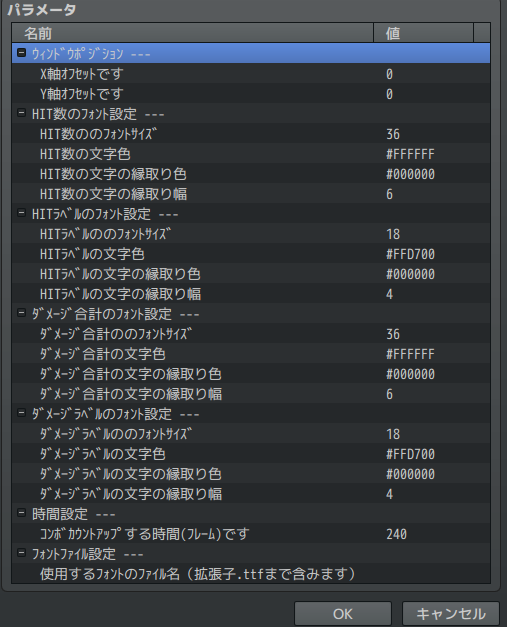

# Sakura_ShowComboDamage
✨ コンボダメージ表示プラグイン

## ダウンロード
[Sakura_ShowComboDamage.js](https://raw.githubusercontent.com/Sakurano6130/SakuraPlugins/main/Sakura_ShowComboDamage/Sakura_ShowComboDamage.js)

## 更新履歴
| ver   | 日付       | 説明                                                                                                       |
| ----- | ---------- | ---------------------------------------------------------------------------------------------------------- |
| 1.0.1 | 2024/10/09 | コンボ表示リセット後の１ヒット目の表示ができていないことがあったため、コンボ表示をリセットする処理を見直し |
| 1.0.0 | 2024/10/07 | 公開                                                                                                       |

## 機能概要

戦闘中にヒット数と合計ダメージを表示します。

## プラグインパラメータ

### ｳｨﾝﾄﾞｳﾎﾟｼﾞｼｮﾝ

- **windowOffsetX** 
  - X軸ｵﾌｾｯﾄです

- **windowOffsetY** 
  - Y軸ｵﾌｾｯﾄです

### HIT数のﾌｫﾝﾄ設定

- **fontSizeHitCount** 
  - HIT数ののﾌｫﾝﾄｻｲｽﾞです

- **textColorHitCount** 
  - HIT数の文字色です

- **outlineColorHitCount** 
  - HIT数の文字の縁取り色です

- **outlineWidthHitCount** 
  - HIT数の文字の縁取り幅です

### HITﾗﾍﾞﾙのﾌｫﾝﾄ設定

- **fontSizeLabel** 
  - HITﾗﾍﾞﾙののﾌｫﾝﾄｻｲｽﾞです

- **textColorLabel** 
  - HITﾗﾍﾞﾙの文字色です

- **outlineColorLabel** 
  - HITﾗﾍﾞﾙの文字の縁取り色です

- **outlineWidthLabel** 
  - HITﾗﾍﾞﾙの文字の縁取り幅です

### ﾀﾞﾒｰｼﾞ合計のﾌｫﾝﾄ設定

- **fontSizeDamageSummary** 
  - ﾀﾞﾒｰｼﾞ合計ののﾌｫﾝﾄｻｲｽﾞです

- **textColorDamageSummary** 
  - ﾀﾞﾒｰｼﾞ合計の文字色です

- **outlineColorDamageSummary** 
  - ﾀﾞﾒｰｼﾞ合計の文字の縁取り色です

- **outlineWidthDamageSummary** 
  - ﾀﾞﾒｰｼﾞ合計の文字の縁取り幅です

### ﾀﾞﾒｰｼﾞﾗﾍﾞﾙのﾌｫﾝﾄ設定

- **fontSizeForDamageLabel** 
  - ﾀﾞﾒｰｼﾞﾗﾍﾞﾙののﾌｫﾝﾄｻｲｽﾞです

- **textColorForDamageLabel** 
  - ﾀﾞﾒｰｼﾞﾗﾍﾞﾙの文字色です

- **outlineColorForDamageLabel** 
  - ﾀﾞﾒｰｼﾞﾗﾍﾞﾙの文字の縁取り色です

- **outlineWidthForDamageLabel** 
  - ﾀﾞﾒｰｼﾞﾗﾍﾞﾙの文字の縁取り幅です

### 時間設定

- **durationForHitCount** 
  - ｺﾝﾎﾞｶｳﾝﾄｱｯﾌﾟする時間(ﾌﾚｰﾑ)です

### ﾌｫﾝﾄﾌｧｲﾙ設定

- **fontFile** 
  - 使用するﾌｫﾝﾄのﾌｧｲﾙ名（拡張子.ttfまで含みます）
  - 注）プロジェクトフォルダの`fonts`フォルダに拡張子`.ttf`のファイルを入れてください。

## プラグインコマンドはありません

# License
- This software is released under the MIT license. http://opensource.org/licenses/mit-license.php
