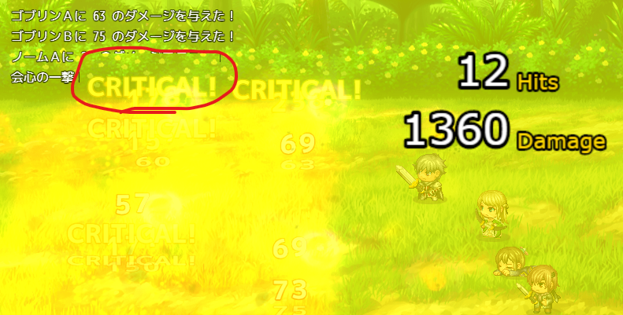

# Sakura_SvBattleExtend
サイドビュー戦闘をいい感じにします✨  β版

## ダウンロード
[Sakura_SvBattleExtend.js](https://raw.githubusercontent.com/Sakurano6130/SakuraPlugins/main/Sakura_SvBattleExtend/Sakura_SvBattleExtend.js)

## 更新履歴
| ver   | 日付       | 説明                                                                                                                                                                                                           |
| ----- | ---------- | -------------------------------------------------------------------------------------------------------------------------------------------------------------------------------------------------------------- |
| 0.6.0 | 2024/09/30 | 敵画像の上に線が出ていた不具合の対応 スキル表示のフキダシをオンオフにできるように オフにするとツクールMZデフォルトのバトルログのレイアウトになる これにより他のプラグインの挙動を邪魔しないようにする |
| 0.5.0 | 2024/09/29 | β版公開                                                                                                                                                                                                        |

## 機能概要
### ダメージ判定とダメージポップをMZアニメーションのフラッシュのタイミングに合わせて行う（これにより多段ヒットするダメージの表現ができる）
- フラッシュのタイミングで複数回ダメージ判定が入るようになるため、ゲームバランスにご注意を。
- 1回しかダメージさせたくないときは、フラッシュが1回だけになるように、アニメーションを直してください。
- MVアニメーションには非対応（1回だけダメージします）。もしご要望あれば考えます。

### アクターやエネミーが行動時に相手の前に移動するようになる。使用するスキルと相手が表示されるようになる。
### エネミーの名前とHPゲージ、タイムゲージが表示されるようになる
### アクターが待機時に武器を構えるようになる
### エネミーが息づいたような動きになる
### スキル表示はオンオフ指定ができる。オフにするとRPGツクールMZデフォルトの表示になる（これにより他プラグインをお使いで邪魔されたくない場合に対応できます） `ver0.6`

#### 参考
  この設定をオフにして、別プラグイン `MNKR_SimpleMsgSideViewMZ.js` を使うと、シンプルなスキル名表示だけになり戦闘のテンポがよくなっていい感じなのでご紹介します。

  > MNKR_SimpleMsgSideViewMZ.js
  > 
  > author 神無月サスケさま　munokuraさま 改変 Copyright (c) 2021 Munokura Ver.0.0.4 MIT license

  

  [https://github.com/munokura/MNKR-MZ-plugins/blob/master/MNKR_SimpleMsgSideViewMZ.js](https://github.com/munokura/MNKR-MZ-plugins/blob/master/MNKR_SimpleMsgSideViewMZ.js)

  `Sakura_SvBattleExtend` より、`MNKR_SimpleMsgSideViewMZ` を下に配置してください。

## 今後の予定
ver1.0までに以下を対応予定です。

- [x] スキル表示の全体オフ機能追加 `ver0.6で対応済み`
- [ ] 敵ごとに個別に相手の前にジャンプしない設定、HPゲージ非表示設定をできるように
- [ ] スキルごとに個別にスキル表示をしない設定をできるように

## プラグインパラメータ
🚧執筆中

### ウィンドウの重なりについて
  - RPGツクールのウィンドウ描画の仕様で、ウィンドウを重ねて表示した場合、後ろのウィンドウが欠けて表示されたように見えてしまいます。
  - これが気になる方は、[Sakura_NonBlockingWindowLayer](../Sakura_NonBlockingWindowLayer/Sakura_NonBlockingWindowLayer.md)をお試しください。

## β版
- このプラグインは、β版です。今後破壊的変更のある可能性があります。
- 不具合や他プラグインとの競合解決のご相談がありましたら、[https://x.com/minnon6130](https://x.com/minnon6130) まで、リプライかDMお願いします。

# License
- This software is released under the MIT license. http://opensource.org/licenses/mit-license.php
