# Sakura_SvBattleExtend
💥サイドビューバトルいい感じプラグイン


## ダウンロード
[Sakura_SvBattleExtend.js](https://raw.githubusercontent.com/Sakurano6130/SakuraPlugins/main/Sakura_SvBattleExtend/Sakura_SvBattleExtend.js)

## 更新履歴
| ver   | 日付       | 説明                                                                                                                                                                                                           |
| ----- | ---------- | -------------------------------------------------------------------------------------------------------------------------------------------------------------------------------------------------------------- |
| 1.0.0 | 2024/10/07 | 公開                                                                                                                                                                                                           |
| 0.6.0 | 2024/09/30 | 敵画像の上に線が出ていた不具合の対応<br>スキル表示のフキダシをオンオフにできるように<br>オフにするとツクールMZデフォルトのバトルログのレイアウトになる<br>これにより他のプラグインの挙動を邪魔しないようにする |
| 0.5.0 | 2024/09/29 | β版公開                                                                                                                                                                                                        |


## 機能説明
### 💥ダメージ判定とダメージポップをMZアニメーションのフラッシュのタイミングに合わせて行う（これにより多段ヒットするダメージの表現ができる）

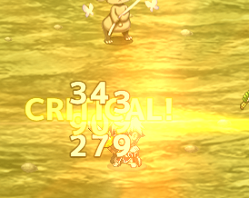

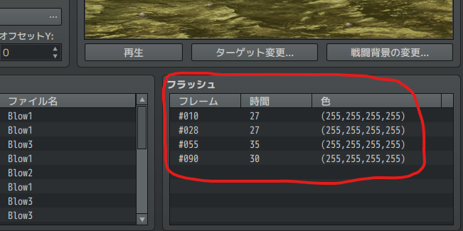

- フラッシュのタイミングで複数回ダメージ判定が入るようになるため、ゲームバランスにご注意を。
- 1回しかダメージさせたくないときは、フラッシュが1回だけになるように、アニメーションを直してください。
- **注）スキルに設定したアニメーションが「なし」になっていると、ダメージ判定されなくなります！！**（ここすっごい大事です！）
  - 下の方に記載した自由にアクションを組みたい方で、スキル側で自動でアニメーションしてほしくない場合は「なし」にしてください。
- MVアニメーションには非対応。もしご要望あれば考えます。

<details>
  <summary>🌟ダメージポップの細かい調整について</summary>
  ダメージポップの細かい調整は、プラグインパラメータで設定できます。デフォルトで良ければ触る必要はありません。

  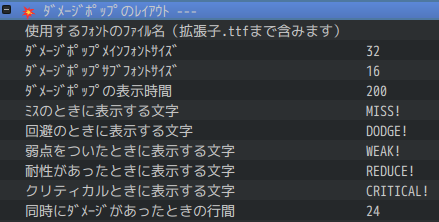

</details>

---

### ⚔️アクターが待機時に武器を構えるようになる

  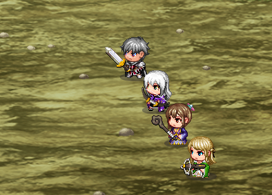

<details>
  <summary>🌟武器の細かい位置調整について</summary>
  武器の細かい位置は、プラグインパラメータで設定できます。デフォルトで良ければ触る必要はありません。

  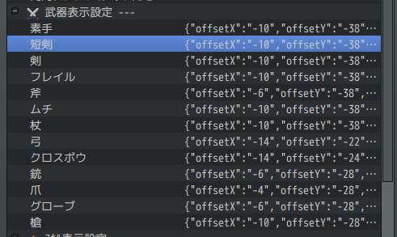 

  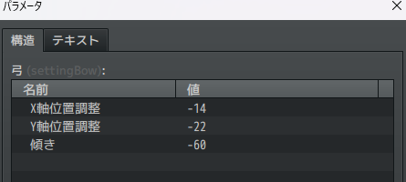
</details>

---
### 👾敵が息づくようになる。


<details>
  <summary>🌟敵毎の個別設定について</summary>
  敵毎に個別に息づかせたくない場合は、以下の記述をすることで息をしなくなります。

  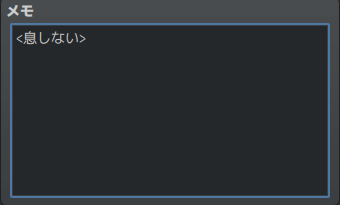

  メモ欄記載例
  ```
  <息しない>
  ```

</details>

---
### 🦘アクターやエネミーが行動時に相手の前に移動するようになる。

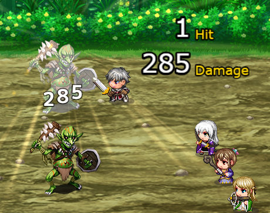

<details>
  <summary>🌟相手の前に出る条件について</summary>
  特に何も考えなくてもいい感じにするために、以下の条件になっています。

  | 条件                                                                   | 移動するか |
  | ---------------------------------------------------------------------- | ---------- |
  | スキル使用者のメモ欄に　`<移動しない>`　が書かれているとき             | 移動しない |
  | スキルのメモ欄に　`<移動しない>`　が書かれているとき                   | 移動しない |
  | 通常攻撃<br>かつ攻撃モーションが振り・突き<br>かつ攻撃範囲が単体のとき | 移動する   |
  | 通常攻撃<br>かつ攻撃モーションが振り・突き<br>かつ攻撃範囲が複数のとき | 移動しない |
  | 通常攻撃<br>かつ攻撃モーションが射撃のとき                             | 移動しない |
  | 魔法<br>かつ対象が味方<br>かつ範囲が単体のとき                         | 移動する   |
  | 魔法<br>かつ対象が味方<br>かつ範囲が複数のとき                         | 移動しない |
  | 魔法<br>かつ対象が敵のとき                                             | 移動しない |
  | 上記以外<br>かつ範囲が単体のとき                                       | 移動する   |
  | 上記以外<br>かつ範囲が複数のとき                                       | 移動しない |

  メモ欄記載例
  ```
  <移動しない>
  ```

  フローにするとこんな感じ...めっちゃ複雑...

  ```mermaid
graph TD;
    A[スキル使用者のメモ欄に<br><移動しない>が書かれているか] -->|はい| M[移動しない];
    A -->|いいえ| B[スキルのメモ欄に<br><移動しない>が書かれているか];
    B -->|はい| M;
    B -->|いいえ| C[通常攻撃か？];
    C -->|はい| D[攻撃モーションが<br>振り・突きか？];
    D -->|はい| E[攻撃範囲が<br>単体か？];
    E -->|はい| L[移動する];
    E -->|いいえ| M;
    D -->|いいえ| F[攻撃モーションが<br>射撃か？];
    F -->|はい| M;
    C -->|いいえ| G[魔法か？];
    G -->|魔法| H[対象が味方か？];
    H -->|はい| I[範囲が単体か？];
    I -->|はい| L;
    I -->|いいえ| M;
    H -->|いいえ| M;
    G -->|物理| J[範囲が単体か？];
    J -->|はい| L;
    J -->|いいえ| M;


  ```

</details>

---

### 💬使用するスキルと相手が表示されるようになる。

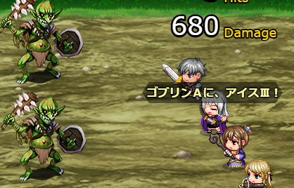

<details>
  <summary>🌟スキルごとの表示設定について</summary>
  例えば、通常攻撃は表示させたくない場合など、スキルごとに個別に非表示にしたい場合は、スキルのメモ欄に `<名前表示しない>` と記述することで非表示にすることができます。

  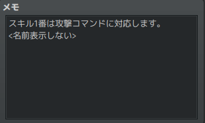

  メモ欄記載例
  ```
  <名前表示しない>
  ```
</details>

<details>
  <summary>🌟スキル表示の全体オフについて</summary>
  スキル表示は全体的にオンオフ指定ができます。オフにするとRPGツクールMZデフォルトの表示になる（これにより他プラグインをお使いで邪魔されたくない場合に対応できます）

  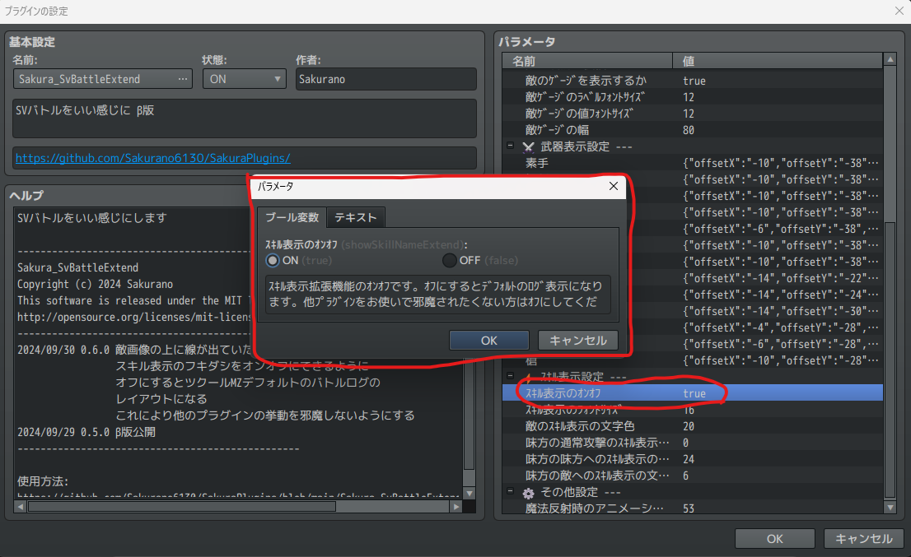

#### 参考
  この設定をオフにして、別プラグイン `MNKR_SimpleMsgSideViewMZ.js` を使うと、シンプルなスキル名表示だけになり戦闘のテンポがよくなっていい感じなのでご紹介します。

  > MNKR_SimpleMsgSideViewMZ.js
  > 
  > author 神無月サスケさま　munokuraさま 改変 Copyright (c) 2021 Munokura Ver.0.0.4 MIT license

  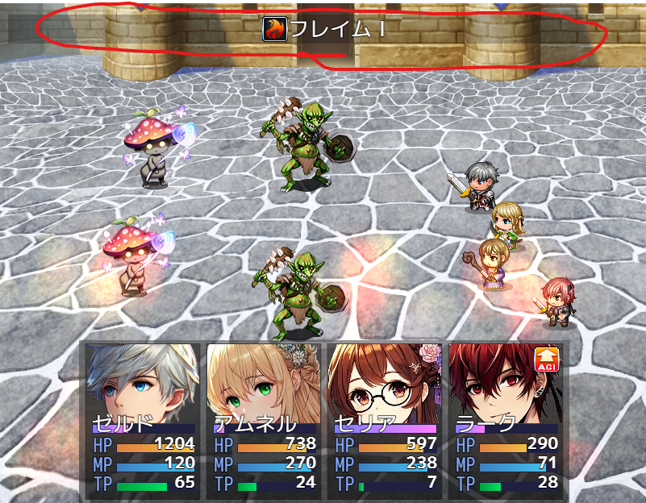

  [https://github.com/munokura/MNKR-MZ-plugins/blob/master/MNKR_SimpleMsgSideViewMZ.js](https://github.com/munokura/MNKR-MZ-plugins/blob/master/MNKR_SimpleMsgSideViewMZ.js)

  `Sakura_SvBattleExtend` より、`MNKR_SimpleMsgSideViewMZ` を下に配置してください。
</details>


## 関連プラグインについて

もっといい感じにするために、以下の２つのプラグインがあります。どちらも入れるだけで動作します。

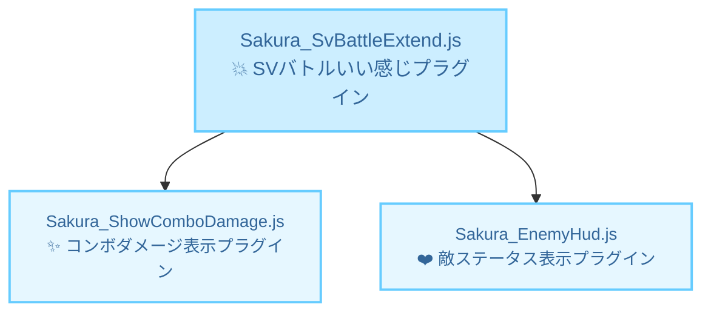

<details>
  <summary>✨コンボ表示プラグイン</summary>
  合計ヒット数、ダメージを表示できます。このプラグイン単独でも動作します。

  [Sakura_ShowComboDamage](../Sakura_ShowComboDamage/Sakura_ShowComboDamage.md)

  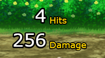

</details>

<details>
  <summary>❤️敵ステータス表示プラグイン</summary>
  敵の名前、HPゲージ、タイムゲージを表示できます。このプラグイン単独でも動作します。

  [Sakura_EnemyHud](../Sakura_EnemyHud/Sakura_EnemyHud.md)

  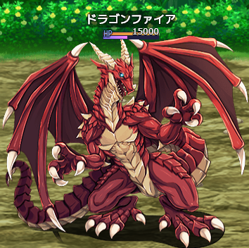

</details>

---

### ここまでの機能で良ければ、プラグインを入れるだけで自動的に良い感じになります。以下は、スキルごとの動きを自由に編集・作成したい方向けの機能です。（ちょっと複雑です...）

---
### 📝スキルごとに個別にアクションを指定することができる。アクションは自由に編集、作成することができる。

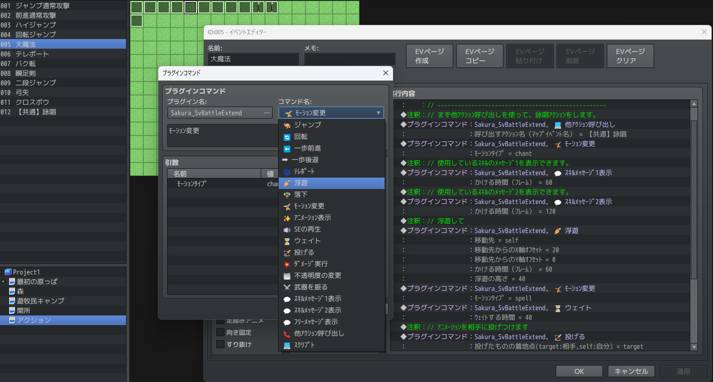

<details>
  <summary>🌟詳しいやり方はこちら</summary>

  ### 前提

  - 1つの行動は以下の流れになっています。自由に行動を定義できるのは、下記の `B` の部分です！（ここ大事です！）
  - なので、`C` のスキルのアニメーション表示以降のことはやらなくていいということです。
  - 逆に言うと、全部 `B` でやりたければ、スキルのメモ欄に`<名前表示しない>`を設定し、スキルのアニメーションを`なし`にすれば、`A` と `C` `D` では何も行われなくなります。

  ```mermaid
  graph TD;
      S((行動開始)) --> A[A.スキル名を表示する];
      A --> B[B.定義したアクションを実行する];
      B --> C[C.相手に、使用中のスキルに設定されたアニメーションを表示する];
      C --> D[D.アニメーションのフラッシュのタイミングでダメージを与える];
      D --> E[E.元の位置に戻る];
      E --> F((行動終了));

      style S fill:#CCFFCC,stroke:#33CC33,stroke-width:2px;
      style F fill:#CCFFCC,stroke:#33CC33,stroke-width:2px;
      style B fill:#FFFF99,stroke:#FFCC00,stroke-width:3px;
  ```


  ### 準備
  - まず、以下のサンプルプロジェクトをダウンロードして展開してください。

    [SVバトルいい感じアクションサンプルプロジェクト](Sakura_SvBattleExtend_SampleProject.zip)

    右クリックでダウンロードまたは、リンク先の`view raw`を押せばダウンロードできるはず...

    

  - ご自身のプロジェクトをRPGツクールMZで開いた状態で、サンプルプロジェクトを多重起動してください。
  - `いい感じアクションテンプレ`という名前のマップをコピーして、ご自身のプロジェクトにコピーしてください。

    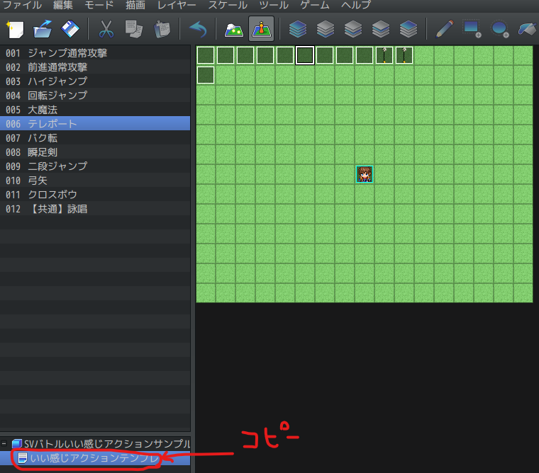

  - `/img/characters` の中にある矢の画像 `$Arrow01.png` をご自身のプロジェクトの `/img/characters` の中にコピーしてください。
  - 注）この画像は、ツクールMZに最初から入っている弓矢の画像から、矢の部分を取り出したものです。なのでRPGツクールMZ正規ユーザーしか使えません。詳細はRPGツクールMZ規約を参照ください。

    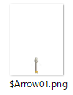

  ### サンプルプロジェクトの役目はこれで終わりです。

---

  - プラグインパラメータを開き、ご自身のプロジェクトにコピーされた `いい感じアクションテンプレ` のマップIDを選択してください。(コピーしたら自動的にマップIDが採番されると思うので、そのIDを指定してください。)

    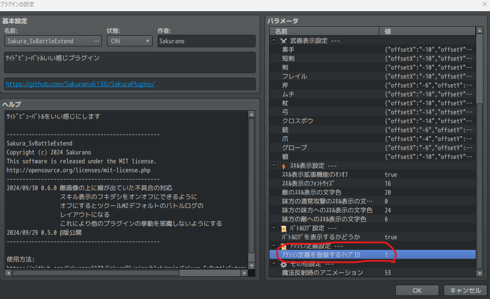    

    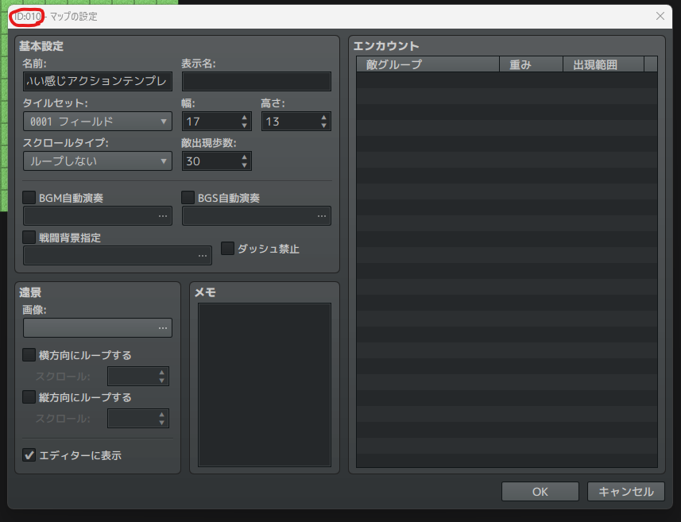

  ### アクション適用
  - `いい感じアクションテンプレ` のイベント名に合わせて、スキルのメモ欄に `<アクション:イベント名>` と記述します。これで、スキルとアクションが紐づきます。
  - 注）`<` `>` `:` これらは半角じゃないとだめです。

  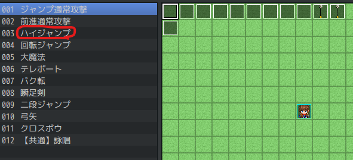

  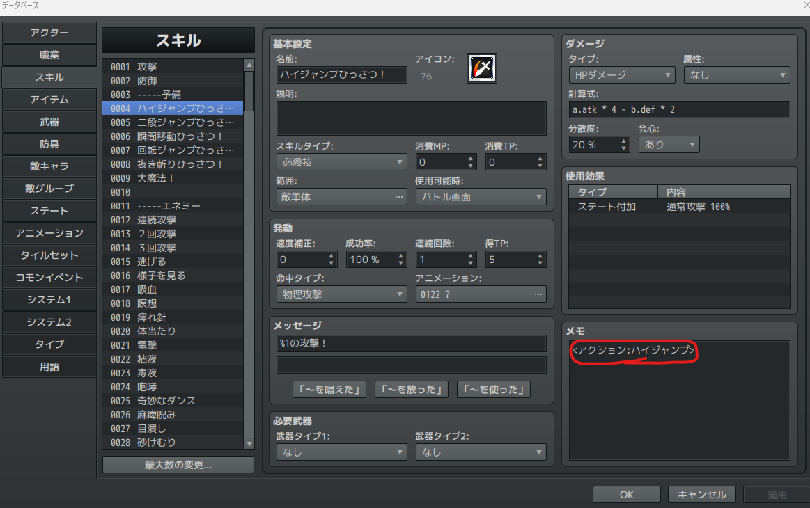

  メモ欄記述例

  ```
  <アクション:ハイジャンプ>
  ```

  ```
  <アクション:回転ジャンプ>
  ```

  ```
  <アクション:大魔法>
  ```

  ```
  <アクション:テレポート>
  ```

  ```
  <アクション:バク転>
  ```

  ```
  <アクション:瞬足剣>
  ```

  ```
  <アクション:弓矢>
  ```

  ```
  <アクション:クロスボウ>
  ```

  ### アクション編集
  - `いい感じアクションテンプレ` のイベントの中身を編集することで、自由にアクションを編集することができます。
  - 読み取られるのは、 `Sakura_SvBattleExtendのプラグインコマンド` と `ピクチャの処理（赤枠部分）` だけです。
  - それ以外のイベントコマンドは、無視されます。（ここも大事です！）

    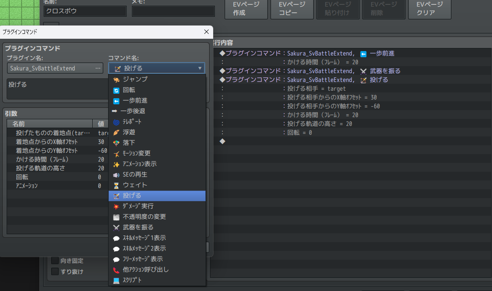

    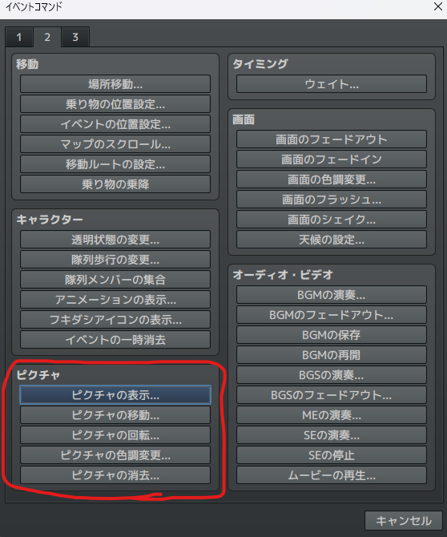

  - 事前に用意されたイベントだけでなく、新しくイベントを作って、その`イベント名`とスキルのメモ欄に `<アクション:イベント名>` をそろえれば、いくつでもアクションを作ることができます。

  ### イベントの画像について
  - イベントに画像をつけておくと、ﾌﾟﾗｸﾞｲﾝｺﾏﾝﾄﾞ`投げる`のときに、その画像が表示されます。
  
    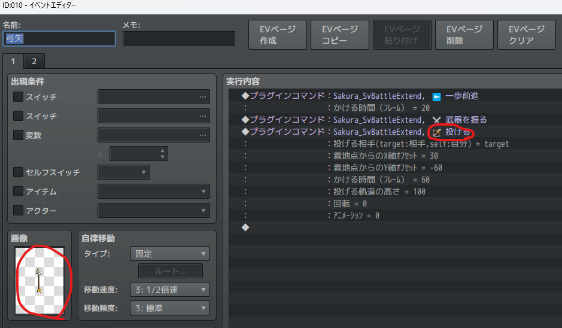

  ### イベントのページについて
  - イベントを複数ページにしておくと、その条件にあったページの内容が実行されます。
  - スイッチが変わったら画像やアクションが変わるなどの演出ができます。

    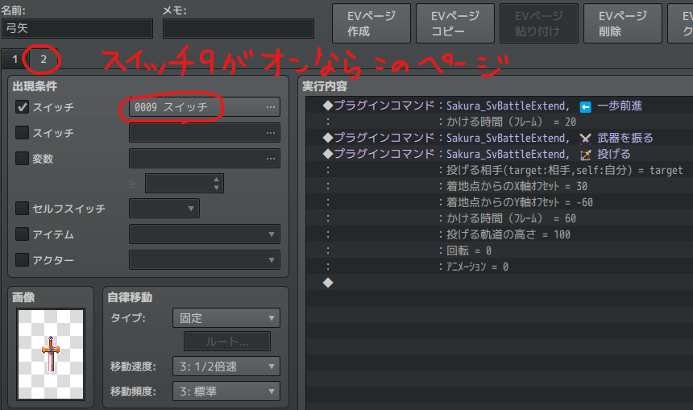


  ### 他ｱｸｼｮﾝ呼び出しをするときは、無限ループにご注意を！
  - ｱｸｼｮﾝから他のｱｸｼｮﾝを名前を指定して呼び出すことができます。これにより、共通アクションのような使い方ができます。
  - ただし、呼び出し先から再び呼び出し元を呼び出すと無限ループとなりエラーになりますのでご注意ください。

</details>


# License
- This software is released under the MIT license. http://opensource.org/licenses/mit-license.php
