# Sakura_SvBattleExtend
💥サイドビューバトルいい感じプラグイン


## ダウンロード
[Sakura_SvBattleExtend.js](https://raw.githubusercontent.com/Sakurano6130/SakuraPlugins/main/Sakura_SvBattleExtend/Sakura_SvBattleExtend.js)

## 更新履歴
| ver   | 日付       | 説明                                                                                                                                                                                                           |
| ----- | ---------- | -------------------------------------------------------------------------------------------------------------------------------------------------------------------------------------------------------------- |
| 1.0.0 | 2024/10/06 | 公開                                                                                                                                                                                                           |
| 0.6.0 | 2024/09/30 | 敵画像の上に線が出ていた不具合の対応<br>スキル表示のフキダシをオンオフにできるように<br>オフにするとツクールMZデフォルトのバトルログのレイアウトになる<br>これにより他のプラグインの挙動を邪魔しないようにする |
| 0.5.0 | 2024/09/29 | β版公開                                                                                                                                                                                                        |


## 機能説明
### 💥ダメージ判定とダメージポップをMZアニメーションのフラッシュのタイミングに合わせて行う（これにより多段ヒットするダメージの表現ができる）


- フラッシュのタイミングで複数回ダメージ判定が入るようになるため、ゲームバランスにご注意を。
- 1回しかダメージさせたくないときは、フラッシュが1回だけになるように、アニメーションを直してください。
- MVアニメーションには非対応（1回だけダメージします）。もしご要望あれば考えます。

<details>
  <summary>🌟ダメージポップの細かい調整について</summary>
  ダメージポップの細かい調整は、プラグインパラメータで設定できます。デフォルトで良ければ触る必要はありません。

  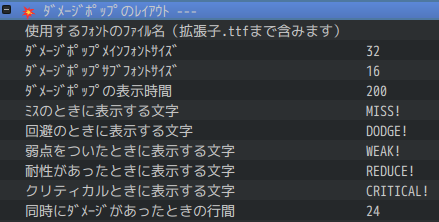

</details>

---

### ⚔️アクターが待機時に武器を構えるようになる

  

<details>
  <summary>🌟武器の細かい位置調整について</summary>
  武器の細かい位置は、プラグインパラメータで設定できます。デフォルトで良ければ触る必要はありません。

   

  
</details>

---
### 👾敵が息づくようになる。


<details>
  <summary>🌟敵毎の個別設定について</summary>
  敵毎に個別に息づかせたくない場合は、以下の記述をすることで息をしなくなります。

  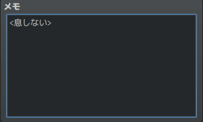

  メモ欄記載例
  ```
  <息しない>
  ```

</details>

---
### 🦘アクターやエネミーが行動時に相手の前に移動するようになる。


<details>
  <summary>🌟相手の前に出る条件について</summary>
  特に何も考えなくてもいい感じにするために、以下の条件になっています。

  | 条件                                                                   | 移動するか |
  | ---------------------------------------------------------------------- | ---------- |
  | スキル使用者のメモ欄に　`<移動しない>`　が書かれているとき             | 移動しない |
  | スキルのメモ欄に　`<移動しない>`　が書かれているとき                   | 移動しない |
  | 通常攻撃<br>かつ攻撃モーションが振り・突き<br>かつ攻撃範囲が単体のとき | 移動する   |
  | 通常攻撃<br>かつ攻撃モーションが振り・突き<br>かつ攻撃範囲が複数のとき | 移動しない |
  | 通常攻撃<br>かつ攻撃モーションが射撃のとき                             | 移動しない |
  | 魔法<br>かつ対象が味方<br>かつ範囲が単体のとき                         | 移動する   |
  | 魔法<br>かつ対象が味方<br>かつ範囲が複数のとき                         | 移動しない |
  | 魔法<br>かつ対象が敵のとき                                             | 移動しない |
  | 上記以外<br>かつ範囲が単体のとき                                       | 移動する   |
  | 上記以外<br>かつ範囲が複数のとき                                       | 移動しない |

  メモ欄記載例
  ```
  <移動しない>
  ```

  フローにするとこんな感じ...めっちゃ複雑...

  ```mermaid
graph TD;
    A[スキル使用者のメモ欄に<br><移動しない>が書かれているか] -->|はい| M[移動しない];
    A -->|いいえ| B[スキルのメモ欄に<br><移動しない>が書かれているか];
    B -->|はい| M;
    B -->|いいえ| C[通常攻撃か？];
    C -->|はい| D[攻撃モーションが<br>振り・突きか？];
    D -->|はい| E[攻撃範囲が<br>単体か？];
    E -->|はい| L[移動する];
    E -->|いいえ| M;
    D -->|いいえ| F[攻撃モーションが<br>射撃か？];
    F -->|はい| M;
    F -->|いいえ| G[魔法か？];
    G -->|はい| H[対象が味方か？];
    H -->|はい| I[範囲が単体か？];
    I -->|はい| L;
    I -->|いいえ| M;
    H -->|いいえ| M;
    G -->|いいえ| J[範囲が単体か？];
    J -->|はい| L;
    J -->|いいえ| M;


  ```

</details>

---

### 💬使用するスキルと相手が表示されるようになる。


<details>
  <summary>🌟スキルごとの表示設定について</summary>
  例えば、通常攻撃は表示させたくない場合など、スキルごとに個別に非表示にしたい場合は、スキルのメモ欄に `<名前表示しない>` と記述することで非表示にすることができます。

  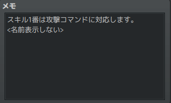

  メモ欄記載例
  ```
  <名前表示しない>
  ```
</details>

<details>
  <summary>🌟スキル表示の全体オフについて</summary>
  スキル表示は全体的にオンオフ指定ができます。オフにするとRPGツクールMZデフォルトの表示になる（これにより他プラグインをお使いで邪魔されたくない場合に対応できます）

  

#### 参考
  この設定をオフにして、別プラグイン `MNKR_SimpleMsgSideViewMZ.js` を使うと、シンプルなスキル名表示だけになり戦闘のテンポがよくなっていい感じなのでご紹介します。

  > MNKR_SimpleMsgSideViewMZ.js
  > 
  > author 神無月サスケさま　munokuraさま 改変 Copyright (c) 2021 Munokura Ver.0.0.4 MIT license

  

  [https://github.com/munokura/MNKR-MZ-plugins/blob/master/MNKR_SimpleMsgSideViewMZ.js](https://github.com/munokura/MNKR-MZ-plugins/blob/master/MNKR_SimpleMsgSideViewMZ.js)

  `Sakura_SvBattleExtend` より、`MNKR_SimpleMsgSideViewMZ` を下に配置してください。
</details>


## 関連プラグインについて

もっといい感じにするために、以下の２つのプラグインがあります。どちらも入れるだけで動作します。

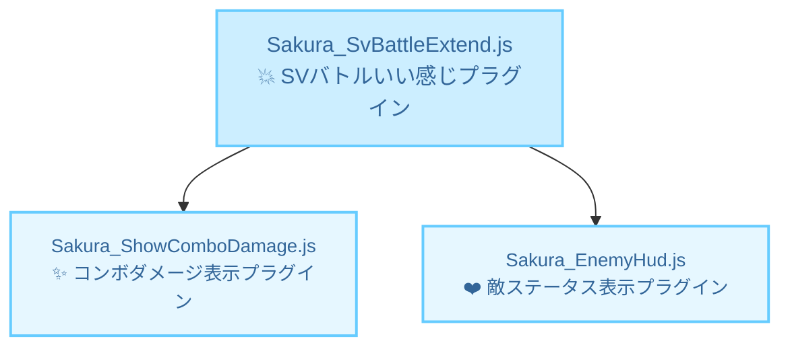

<details>
  <summary>✨コンボ表示プラグイン</summary>
  合計ヒット数、ダメージを表示できます。このプラグイン単独でも動作します。

  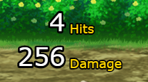

</details>

<details>
  <summary>❤️敵ステータス表示プラグイン</summary>
  敵の名前、HPゲージ、タイムゲージを表示できます。このプラグイン単独でも動作します。

  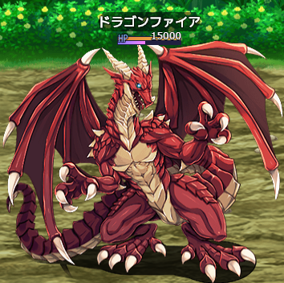

</details>

---

### ここまでの機能で良ければ、プラグインを入れるだけで自動的に良い感じになります。以下は、スキルごとの動きを自由に編集・作成したい方向けの機能です。（ちょっと複雑です...）

---
### 📝スキルごとに個別にアクションを指定することができる。アクションは自由に編集、作成することができる。


<details>
  <summary>🌟詳しいやり方はこちら</summary>

  ### 準備
  - まず、以下のサンプルプロジェクトをダウンロードして展開してください。

  [SVバトルいい感じアクションサンプルプロジェクト](SVバトルいい感じアクションサンプル.zip)

  - `いい感じアクションテンプレ`という名前のマップをコピーして、ご自身のプロジェクトにコピーしてください。

    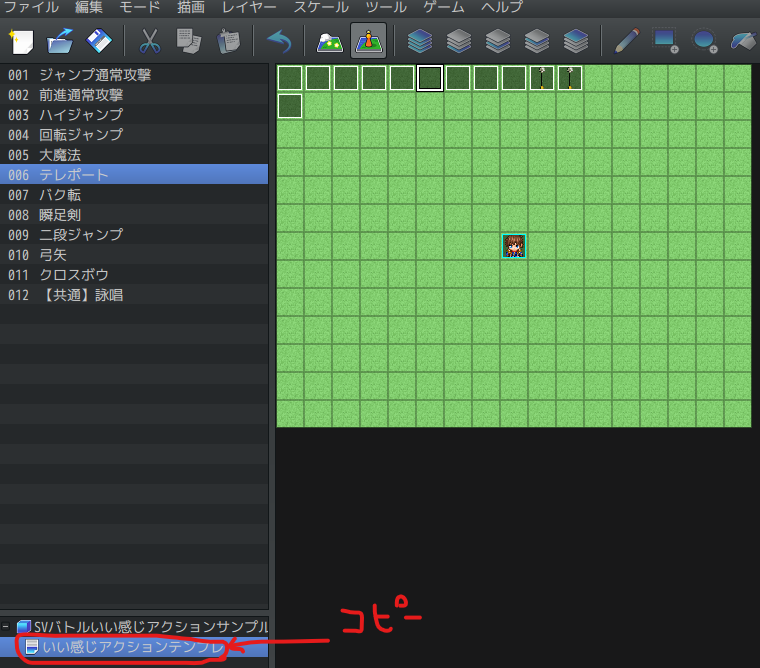

  - `/img/characters` の中にある矢の画像 `$Arrow01.png` をご自身のプロジェクトの `/img/characters` の中にコピーしてください。

    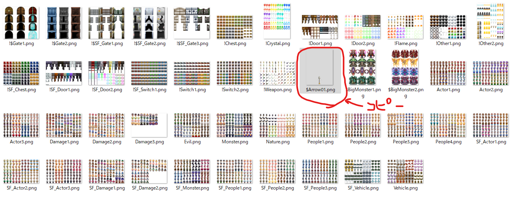

  - プラグインパラメータを開き、ご自身のプロジェクトにコピーされた `いい感じアクションテンプレ` のマップIDを選択してください。

    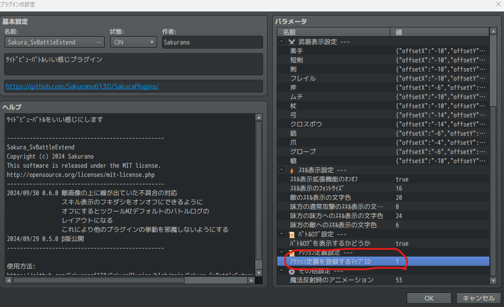    

  ### アクション適用
  - `いい感じアクションテンプレ` のイベント名に合わせて、スキルのメモ欄に `<アクション:イベント名>` と記述します。これで、スキルとアクションが紐づきます。

  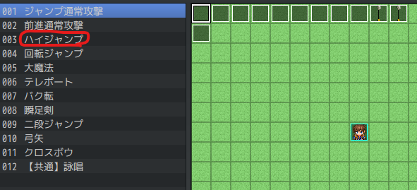

  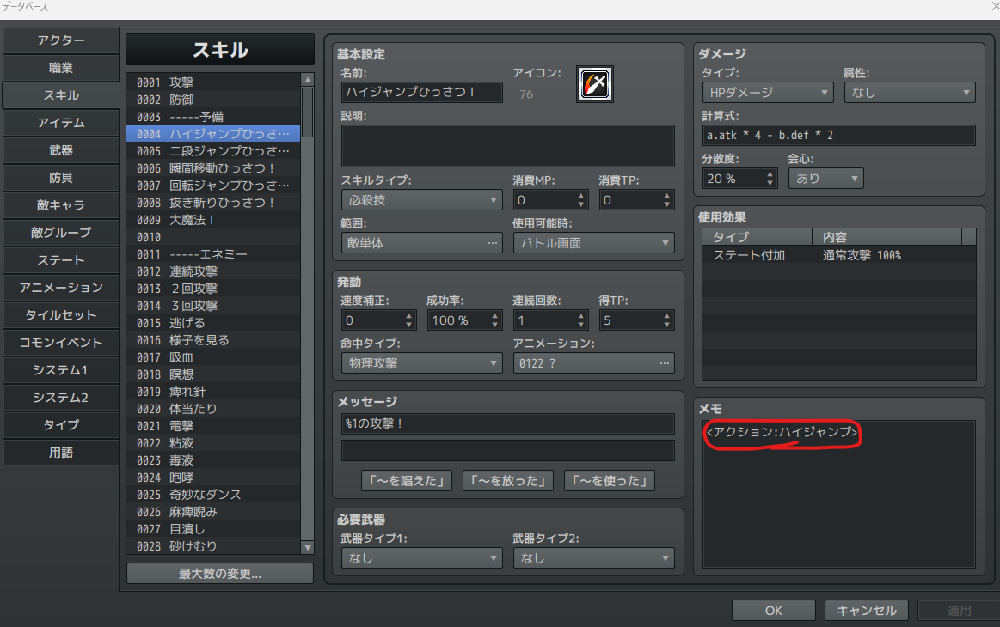

  メモ欄記述例

  ```
  <アクション:ハイジャンプ>
  ```

  ```
  <アクション:回転ジャンプ>
  ```

  ```
  <アクション:大魔法>
  ```

  ```
  <アクション:テレポート>
  ```

  ```
  <アクション:バク転>
  ```

  ```
  <アクション:瞬足剣>
  ```

  ```
  <アクション:弓矢>
  ```

  ```
  <アクション:クロスボウ>
  ```

  ### アクション編集
  - `いい感じアクションテンプレ` のイベントの中身を編集することで、自由にアクションを編集することができます。

    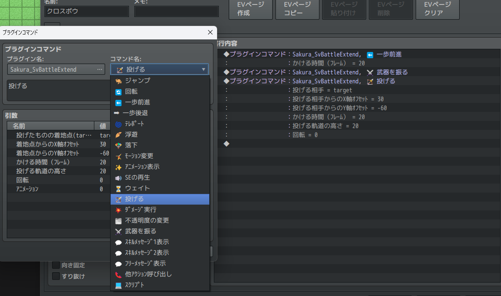

    注）読み取られるのは、Sakura_SvBattleExtendのプラグインコマンドだけです。


</details>


# License
- This software is released under the MIT license. http://opensource.org/licenses/mit-license.php
