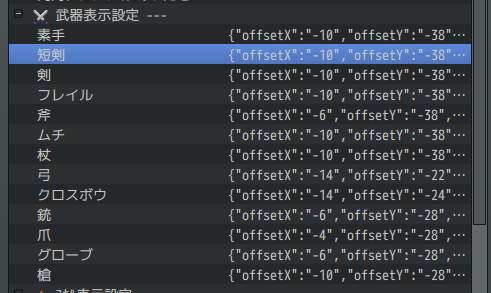
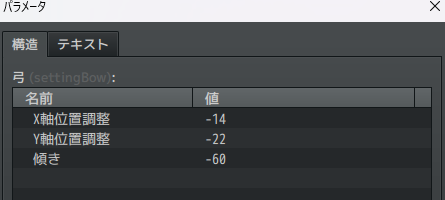
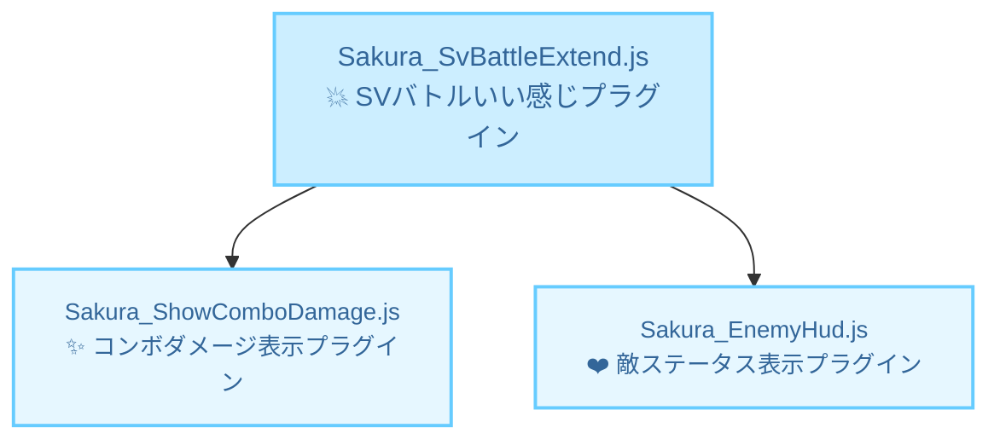

# Sakura_SvBattleExtend
💥サイドビューバトルいい感じプラグイン


## ダウンロード
[Sakura_SvBattleExtend.js](https://raw.githubusercontent.com/Sakurano6130/SakuraPlugins/main/Sakura_SvBattleExtend/Sakura_SvBattleExtend.js)

## 更新履歴
| ver   | 日付       | 説明                                                                                                                                                                                                           |
| ----- | ---------- | -------------------------------------------------------------------------------------------------------------------------------------------------------------------------------------------------------------- |
| 1.0.0 | 2024/10/06 | 公開                                                                                                                                                                                                           |
| 0.6.0 | 2024/09/30 | 敵画像の上に線が出ていた不具合の対応<br>スキル表示のフキダシをオンオフにできるように<br>オフにするとツクールMZデフォルトのバトルログのレイアウトになる<br>これにより他のプラグインの挙動を邪魔しないようにする |
| 0.5.0 | 2024/09/29 | β版公開                                                                                                                                                                                                        |


## 機能概要
### ダメージ判定とダメージポップをMZアニメーションのフラッシュのタイミングに合わせて行う（これにより多段ヒットするダメージの表現ができる）


- フラッシュのタイミングで複数回ダメージ判定が入るようになるため、ゲームバランスにご注意を。
- 1回しかダメージさせたくないときは、フラッシュが1回だけになるように、アニメーションを直してください。
- MVアニメーションには非対応（1回だけダメージします）。もしご要望あれば考えます。

### アクターが待機時に武器を構えるようになる

  

<details>
  <summary>武器の細かい位置調整について</summary>
  武器の細かい位置は、プラグインパラメータで設定できます。デフォルトで良ければ触る必要はありません。

   

  
</details>


### アクターやエネミーが行動時に相手の前に移動するようになる。


<details>
  <summary>相手の前に出る条件について</summary>
  以下の条件になっています。

  | 条件                                                                   | 移動するか |
  | ---------------------------------------------------------------------- | ---------- |
  | スキル使用者のメモ欄に<移動しない>が書かれているとき                   | 移動しない |
  | スキルのメモ欄に<移動しない>が書かれているとき                         | 移動しない |
  | 通常攻撃<br>かつ攻撃モーションが振り・突き<br>かつ攻撃範囲が単体のとき | 移動する   |
  | 通常攻撃<br>かつ攻撃モーションが振り・突き<br>かつ攻撃範囲が複数のとき | 移動しない |
  | 通常攻撃<br>かつ攻撃モーションが射撃のとき                             | 移動しない |
  | 魔法<br>かつ対象が味方<br>かつ範囲が単体のとき                         | 移動する   |
  | 魔法<br>かつ対象が味方<br>かつ範囲が複数のとき                         | 移動しない |
  | 魔法<br>かつ対象が敵のとき                                             | 移動しない |
  | 上記以外<br>かつ範囲が単体のとき                                       | 移動する   |
  | 上記以外<br>かつ範囲が複数のとき                                       | 移動しない |


  フローにするとこんな感じ...めっちゃ複雑...

  ```mermaid
graph TD;
    A[スキル使用者のメモ欄に<br><移動しない>が書かれているか] -->|はい| M[移動しない];
    A -->|いいえ| B[スキルのメモ欄に<br><移動しない>が書かれているか];
    B -->|はい| M;
    B -->|いいえ| C[通常攻撃か？];
    C -->|はい| D[攻撃モーションが<br>振り・突きか？];
    D -->|はい| E[攻撃範囲が<br>単体か？];
    E -->|はい| L[移動する];
    E -->|いいえ| M;
    D -->|いいえ| F[攻撃モーションが<br>射撃か？];
    F -->|はい| M;
    F -->|いいえ| G[魔法か？];
    G -->|はい| H[対象が味方か？];
    H -->|はい| I[範囲が単体か？];
    I -->|はい| L;
    I -->|いいえ| M;
    H -->|いいえ| M;
    G -->|いいえ| J[範囲が単体か？];
    J -->|はい| L;
    J -->|いいえ| M;


  ```

</details>


### 使用するスキルと相手が表示されるようになる。


### ここまでの機能で良ければ、プラグインを入れるだけで自動的に良い感じになります。以下は、スキルごとの動きを自由に編集・作成したい方向けの機能です。（ちょっと複雑です...）

---
### スキルごとに個別にアクションを指定することができる。アクションは自由に編集、作成することができる。


## 関連プラグイン




## プラグインパラメータ
🚧執筆中


### スキル表示は全体的にオンオフ指定ができる。オフにするとRPGツクールMZデフォルトの表示になる（これにより他プラグインをお使いで邪魔されたくない場合に対応できます） `ver0.6`


#### 参考
  この設定をオフにして、別プラグイン `MNKR_SimpleMsgSideViewMZ.js` を使うと、シンプルなスキル名表示だけになり戦闘のテンポがよくなっていい感じなのでご紹介します。

  > MNKR_SimpleMsgSideViewMZ.js
  > 
  > author 神無月サスケさま　munokuraさま 改変 Copyright (c) 2021 Munokura Ver.0.0.4 MIT license

  

  [https://github.com/munokura/MNKR-MZ-plugins/blob/master/MNKR_SimpleMsgSideViewMZ.js](https://github.com/munokura/MNKR-MZ-plugins/blob/master/MNKR_SimpleMsgSideViewMZ.js)

  `Sakura_SvBattleExtend` より、`MNKR_SimpleMsgSideViewMZ` を下に配置してください。

## β版
- このプラグインは、β版です。今後破壊的変更のある可能性があります。
- 不具合や他プラグインとの競合解決のご相談がありましたら、[https://x.com/minnon6130](https://x.com/minnon6130) まで、リプライかDMお願いします。

# License
- This software is released under the MIT license. http://opensource.org/licenses/mit-license.php
