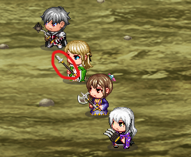
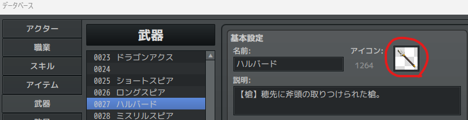
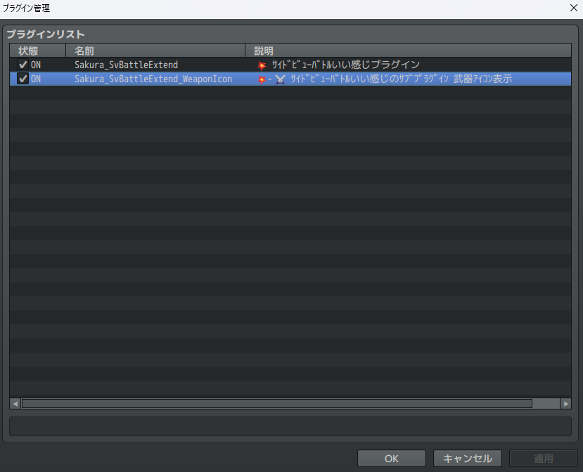
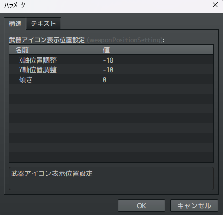
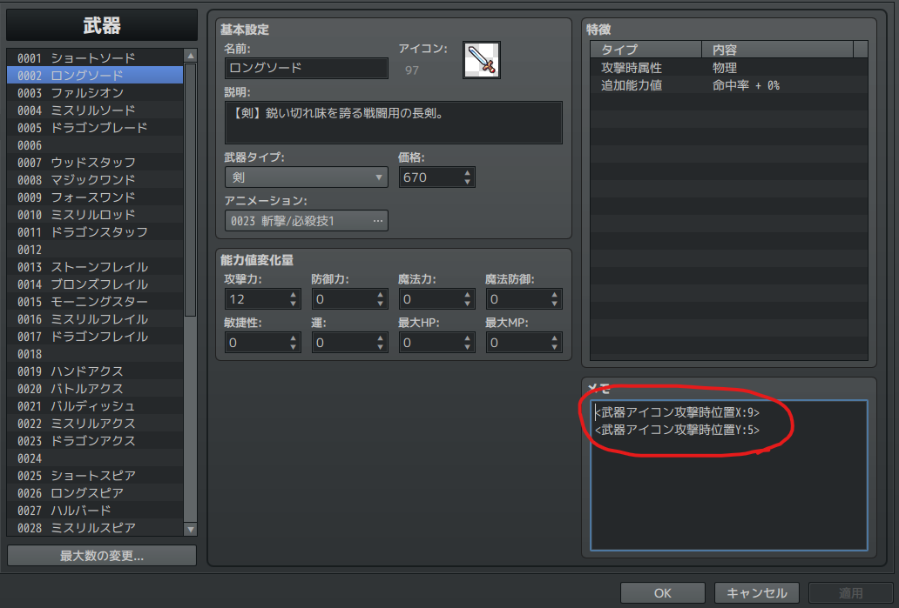

# Sakura_SvBattleExtend_WeaponIcon
💥サイドビューバトルいい感じプラグインのサブプラグイン 武器アイコン表示





## ダウンロード
[Sakura_SvBattleExtend_WeaponIcon.js](https://raw.githubusercontent.com/Sakurano6130/SakuraPlugins/main/Sakura_SvBattleExtend_WeaponIcon/Sakura_SvBattleExtend_WeaponIcon.js)

## 更新履歴
| ver   | 日付       | 説明                           |
| ----- | ---------- | ------------------------------ |
| 1.0.1 | 2024/11/02 | スキル使用時の武器の動きを修正 |
| 1.0.0 | 2024/10/13 | 公開                           |


## 機能説明
### 💥サイドビューバトルいい感じプラグイン（Sakura_SvBattleExtend.js）のサブプラグインです。武器の表示をそれぞれの武器のアイコンに変更します。



### プラグインパラメータ

#### 武器アイコン表示位置設定

武器アイコンの表示位置を調整します。



### 武器の個別設定

武器のメモ欄に以下の記述をすることで、個別設定をすることもできます。
- 構えているときの全体の設定はプラグインパラメータで
- 攻撃する瞬間の微妙な位置調整は、武器アイコンのメモ欄で

という考え方で調整してみてください。
もっと細かく調整したい要望あれば、考えます。



メモ欄記述例

```
<武器アイコン攻撃時位置X:9>
```
```
<武器アイコン攻撃時位置Y:5>
```

### このページで使用しているアイコンについて

yanfly様のアイコンを使用しています。

[http://yanfly.moe/2015/10/23/freebies-mv-ready-ace-icons/](http://yanfly.moe/2015/10/23/freebies-mv-ready-ace-icons/)


# License
- This software is released under the MIT license. http://opensource.org/licenses/mit-license.php
