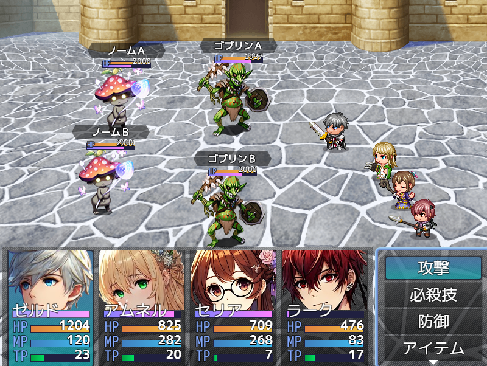

# Sakura_SvBattleExtend
サイドビュー戦闘をいい感じにします✨

## ダウンロード
[Sakura_SvBattleExtend.js](https://raw.githubusercontent.com/Sakurano6130/SakuraPlugins/main/Sakura_SvBattleExtend/Sakura_SvBattleExtend.js)

## 更新履歴
| ver   | 日付       | 説明    |
| ----- | ---------- | ------- |
| 0.5.0 | 2024/09/29 | β版公開 |

## 機能概要
### ダメージ判定とダメージポップをMZアニメーションのフラッシュのタイミングに合わせて行う（これにより多段ヒットするダメージの表現ができる）
- フラッシュのタイミングで複数回ダメージ判定が入るようになるため、ゲームバランスにご注意を。
- 1回しかダメージさせたくないときは、フラッシュが1回だけになるように、アニメーションを直してください。
- MVアニメーションには非対応（1回だけダメージします）。もしご要望あれば考えます。

### アクターやエネミーが行動時に相手の前に移動するようになる。使用するスキルと相手が表示されるようになる。
### エネミーの名前とHPゲージ、タイムゲージが表示されるようになる
### アクターが待機時に武器を構えるようになる

## プラグインパラメータ
🚧執筆中

## β版
- このプラグインは、β版です。今後破壊的変更のある可能性があります。
- 不具合や他プラグインとの競合解決のご相談がありましたら、[[text](https://x.com/minnon6130)](https://x.com/minnon6130)まで、リプライかDMお願いします。

# License
- This software is released under the MIT license. http://opensource.org/licenses/mit-license.php
